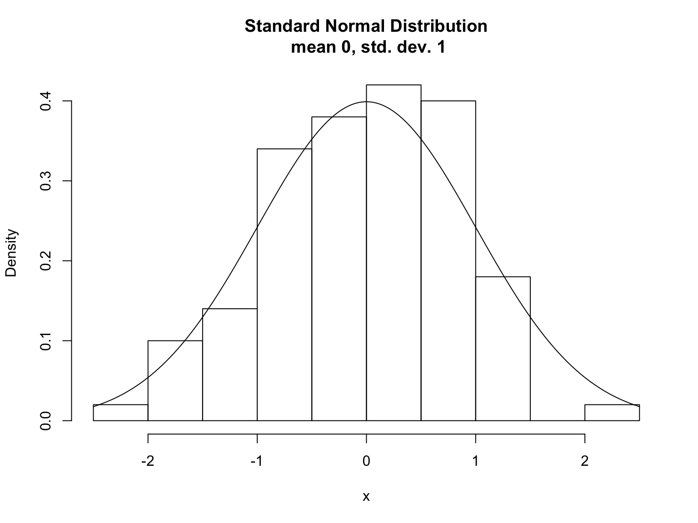
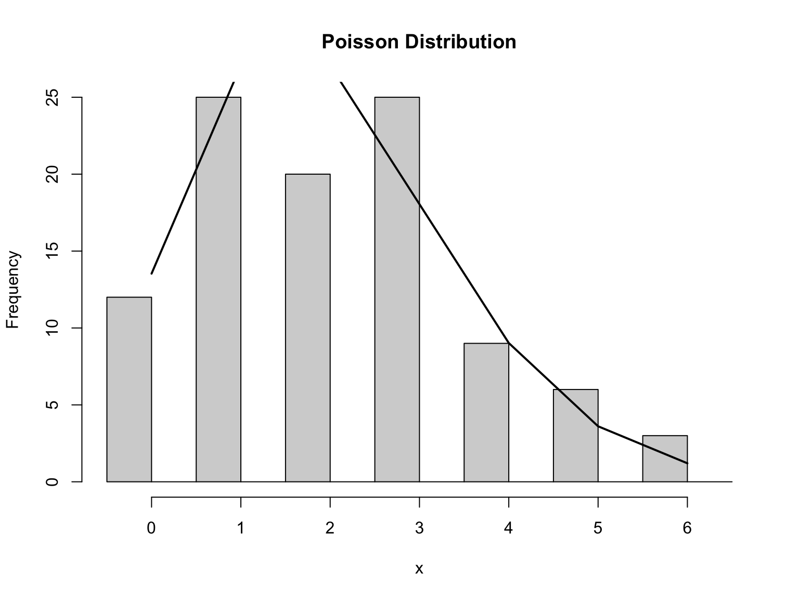
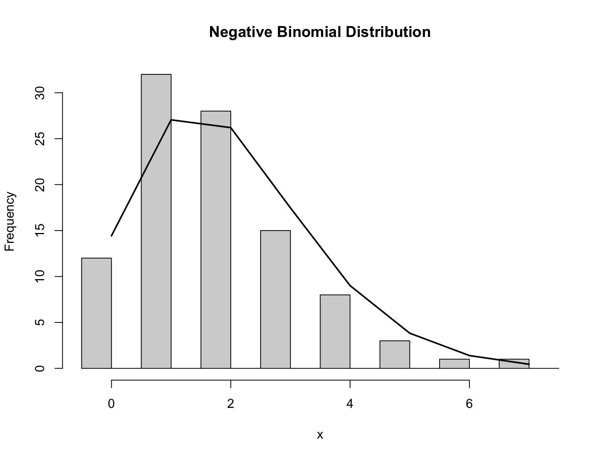
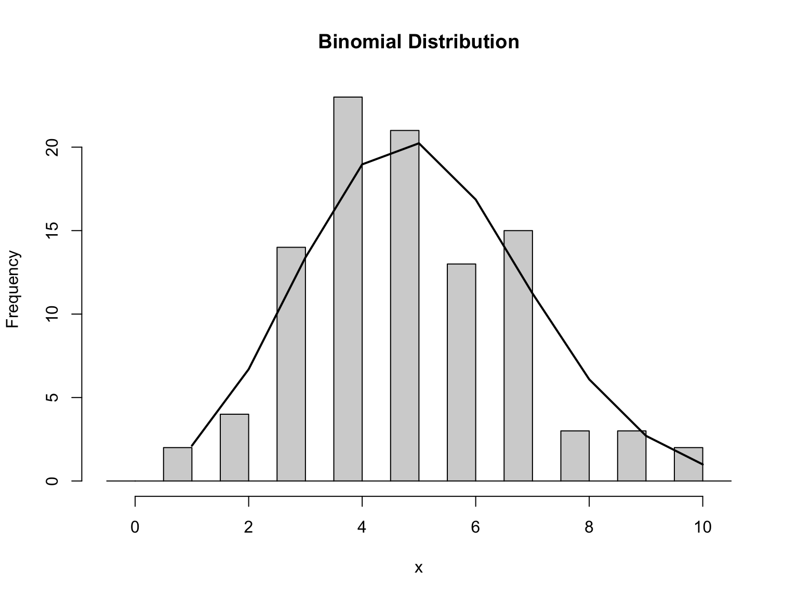

## Welcome and outline

- Review of syllabus
- Random variables and distributions
- Introduction to the R language
- Introduction to `dplyr`

- Book sections:
    - Chapter 0
    - Chapter 1 - section Random Variables
    
A built [html][] version of this lecture is available.

The [source][] R Markdown is also available from Github.

## Learning objectives

- Define random variables and distinguish them from non-random ones
- Recognize some important random distributions from their probability density plots:
    + Normal, Poisson, Negative Binomial, Binomial
- Perform basic data manipulation/exploration in R and dplyr
    + load data from a csv file
    + generate random numbers using `sample()`
    + understand use of `set.seed()`
    + generate histograms
- Clone and contribute to the class [Github](https://github.com/waldronlab/AppStatTrento) repo
- Do an analysis using R Markdown

## A bit about me - research interests

* High-dimensional statistics (more variables than observations)
* Predictive modeling and methodology for validation
* Metagenomic profiling of the human microbiome
* Cancer genomics
* HIV treatment effectiveness
* http://www.waldronlab.org

# Random Variables and Distributions

## Random Variables

- **A random variable**: any characteristic that can be measured or categorized, and where any particular outcome is determined at least partially by chance.

> - Examples:
    - number of new diabetes cases in NYC in a given year
    - The weight of a randomly selected individual in NYC

> - Types:
    - Categorical random variable (e.g. disease / healthy)
    - Discrete random variable (e.g. sequence read counts)
    - Continuous random variable (e.g. normalized qPCR intensity)

## Probability Distributions

 - We use probability distributions to describe the probability of all possible realizations of a random variable
 - In public health we use probability distributions to describe hypotheses or inference about the _population_
    - because we normally cannot observe the entire population
- In practice we study a _sample_ selected from the population

<center>

</center>

## Random Variables - examples

Normally distributed random variable with mean $\mu = 0$ / standard deviation $\sigma = 1$, and a sample of $n=100$



## Random Variables - examples

Poisson distributed random variable ($\lambda = 2$), and a sample of $n=100$.



## Random Variables - examples

Negative Binomially distributed random variable ($size=30, \mu=2$), and a sample of $n=100$.



## Random Variables - examples

- Binomial Distribution random variable ($size=20, prob=0.25$), and a sample of $n=100$.
    - We will _only_ use for binary outcomes
    


# R - basic usage

## Tips for learning R

Pseudo code                                   |   Example code
--------------------------------------------  |   -------------------
library(packagename)                          | library(dplyr)
?functionname                                 | ?select
?package::functionname                        | ?dplyr::select
? 'Reserved keyword or symbol' \color{blue}{(or backticks)} | ? '%>%'
??searchforpossiblyexistingfunctionandortopic | ??simulate
help(package = "loadedpackage")               | help("dplyr")
browseVignettes("packagename")                | browseVignettes("dplyr")

\tiny Slide credit: Marcel Ramos

## Installing Packages

- See the [Bioconductor](http://www.bioconductor.org/) site for more info

Pseudo code: 


```r
source("https://bioconductor.org/biocLite.R")
packages <- c("packagename", "githubuser/repository", "biopackage")
BiocInstaller::biocLite(packages)
```

- Works for CRAN, GitHub, and Bioconductor packages!

## Note about installing `devtools`

- Useful for building packages
- Download and install from GitHub, directly or via BiocInstaller::biocLite()
- Installation dependent on OS ([Rtools](https://cran.r-project.org/bin/windows/Rtools/) for Windows)

## Introduction to the R language

* `5 + 2  #addition`
* `5 - 2  #subtraction`
* `5 * 2  #multiplication`
* `5 / 2  #division`
* `5 ^ 2  #exponentiation`
* `5 ** 2 #exponentiation`
* `5 %% 2 #modulus (a.k.a. remainder)`

## Logic

- `5 < x  #less than`
- `5 <= x #less than or equal to`
- `5 > x  #greater than`
- `5 >= x #greater than or equal to`
- `5 == x #equal to`
- `5 != x #not equal to`
- `!x     #logical NOT`
- `True || False  #stepwise logical OR`
- `True && False  #stepwise logical AND`

## Storing Data: The Rules

- Letters, numbers, dots, underscores
- Must start with a letter or a dot not followed by a number
- No reserve words, No spaces


```r
x <- 5
x * 2
```

```
## [1] 10
```

```r
x <- x + 1
y <- 4
x * y
```

```
## [1] 24
```

## Basic Data Types

- numeric (set seed to sync random number generator):

```r
set.seed(1)
rnorm(5)
```

```
## [1] -0.6264538  0.1836433 -0.8356286  1.5952808  0.3295078
```
- integer:

```r
1:5
```

```
## [1] 1 2 3 4 5
```

```r
sample( 1:5 )
```

```
## [1] 2 1 3 4 5
```

## Basic Data Types (cont'd)

- character:

```r
c("yes", "no")
```

```
## [1] "yes" "no"
```
- factor (play with this to show character/integer properties):

```r
factor(c("yes", "no"))
```

```
## [1] yes no 
## Levels: no yes
```

## Basic Data Types (cont'd)

- ordered factor:

```r
factor(c("good", "very good", "poor"), 
       levels=c("poor", "good", "very good"), 
       ordered=TRUE)
```

```
## [1] good      very good poor     
## Levels: poor < good < very good
```
- logical:

```r
1:5 %in% 4:5
```

```
## [1] FALSE FALSE FALSE  TRUE  TRUE
```

## Basic Data Types (cont'd)

- Missing Values and others - **IMPORTANT**

```r
c(NA, NaN, -Inf, Inf)
```

```
## [1]   NA  NaN -Inf  Inf
```

`class()` to find the class of a variable.

## Vectors Must Be of One Data Mode


```r
c( 1, "2", FALSE)
```

```
## [1] "1"     "2"     "FALSE"
```

```r
c( 1, FALSE )
```

```
## [1] 1 0
```

## Selecting Vector Elements

- One element

```r
x <- 1:4
x[ 2 ]
```

```
## [1] 2
```
- A slice of a vector

```r
x <- 1:10
x[ 4:7 ]
```

```
## [1] 4 5 6 7
```

## Selecting Vector Elements (cont'd)

- Multiple elements ( not contiguous )

```r
x <- c( "a", "b", "c", "d", "e", "f" )
x[ c(5,3,1) ]
```

```
## [1] "e" "c" "a"
```
- Removing elements

```r
x[ -1 ]
```

```
## [1] "b" "c" "d" "e" "f"
```

```r
x[-1:-2]
```

```
## [1] "c" "d" "e" "f"
```

## Selecting Vector Elements (cont'd)

- Using logical vector

```r
x <- 1:10
y <- x%%2 == 0
x[y]
```

```
## [1]  2  4  6  8 10
```

## 2-Dimensional Vectors are Matrices


```r
matrix( 1:20, nrow = 5, ncol = 4 )
```

```
##      [,1] [,2] [,3] [,4]
## [1,]    1    6   11   16
## [2,]    2    7   12   17
## [3,]    3    8   13   18
## [4,]    4    9   14   19
## [5,]    5   10   15   20
```

## Indexing Matrices

- matrix[ r, c ]

```r
boring.matrix <- matrix( 1:20, nrow = 5, ncol = 4 )
dim( boring.matrix )
```

```
## [1] 5 4
```

```r
boring.matrix[ ,1 ]
```

```
## [1] 1 2 3 4 5
```

```r
boring.matrix[ 2, 1 ]
```

```
## [1] 2
```

```r
boring.matrix[ 2, ]
```

```
## [1]  2  7 12 17
```

## Indexing Matrices (cont'd)


```r
boring.matrix
```

```
##      [,1] [,2] [,3] [,4]
## [1,]    1    6   11   16
## [2,]    2    7   12   17
## [3,]    3    8   13   18
## [4,]    4    9   14   19
## [5,]    5   10   15   20
```

```r
boring.matrix[ boring.matrix[ ,1 ] ==3,]
```

```
## [1]  3  8 13 18
```

## Matrix Operations

- Transpose

```r
boring.matrix <- matrix(1:9, nrow = 3)
boring.matrix
```

```
##      [,1] [,2] [,3]
## [1,]    1    4    7
## [2,]    2    5    8
## [3,]    3    6    9
```

```r
t(boring.matrix)
```

```
##      [,1] [,2] [,3]
## [1,]    1    2    3
## [2,]    4    5    6
## [3,]    7    8    9
```

## Matrix Operations (cont'd)

- Adding (note _vectorization_)

```r
boring.matrix + 1
```

```
##      [,1] [,2] [,3]
## [1,]    2    5    8
## [2,]    3    6    9
## [3,]    4    7   10
```

```r
boring.matrix + 1:3
```

```
##      [,1] [,2] [,3]
## [1,]    2    5    8
## [2,]    4    7   10
## [3,]    6    9   12
```

## Matrix Operations (cont'd)

- Adding

```r
boring.matrix
```

```
##      [,1] [,2] [,3]
## [1,]    1    4    7
## [2,]    2    5    8
## [3,]    3    6    9
```

```r
boring.matrix + boring.matrix
```

```
##      [,1] [,2] [,3]
## [1,]    2    8   14
## [2,]    4   10   16
## [3,]    6   12   18
```

## Matrix Operations (cont'd)

- Multiplying

```r
boring.matrix * boring.matrix
```

```
##      [,1] [,2] [,3]
## [1,]    1   16   49
## [2,]    4   25   64
## [3,]    9   36   81
```

```r
boring.matrix %*% boring.matrix
```

```
##      [,1] [,2] [,3]
## [1,]   30   66  102
## [2,]   36   81  126
## [3,]   42   96  150
```

## Naming rows and columns


```r
colnames(boring.matrix) <- c("col.1", "col.2", "col.3")
rownames(boring.matrix) <- c("row.1", "row.2", "row.3")
boring.matrix
```

```
##       col.1 col.2 col.3
## row.1     1     4     7
## row.2     2     5     8
## row.3     3     6     9
```

```r
boring.matrix["row.1", ]
```

```
## col.1 col.2 col.3 
##     1     4     7
```

## Lists are Like Filing Cabinets

* e.g. if we have 5 medical measurements, 10 self-reported measurements, a sex, two parent names:


```r
measurements <- c( 1.3, 1.6, 3.2, 9.8, 10.2 )
self.reporting <- c( 13, 6, 4, 7, 6, 5, 8, 9, 7, 4 )
sex <- FALSE
parents <- c( "Parent1.name", "Parent2.name" )
```

## Lists are Like Filing Cabinets (cont'd)


```r
my.person <- list( measurements, self.reporting, 
                   sex, parents)
my.person
```

```
## [[1]]
## [1]  1.3  1.6  3.2  9.8 10.2
## 
## [[2]]
##  [1] 13  6  4  7  6  5  8  9  7  4
## 
## [[3]]
## [1] FALSE
## 
## [[4]]
## [1] "Parent1.name" "Parent2.name"
```

## Lists are Like Filing Cabinets (cont'd)

* Single bracket accessing

```r
my.person[1:2]
```

```
## [[1]]
## [1]  1.3  1.6  3.2  9.8 10.2
## 
## [[2]]
##  [1] 13  6  4  7  6  5  8  9  7  4
```
* Double bracket accessing

```r
my.person[[1]]
```

```
## [1]  1.3  1.6  3.2  9.8 10.2
```

## Lists are Like Filing Cabinets (cont'd)


```r
my.person <- list( measure = measurements, 
                   parents = parents )
my.person
```

```
## $measure
## [1]  1.3  1.6  3.2  9.8 10.2
## 
## $parents
## [1] "Parent1.name" "Parent2.name"
```

```r
my.person$parents
```

```
## [1] "Parent1.name" "Parent2.name"
```

## The `data.frame` object

* a data.frame is:
  + a matrix with columns of potentially different data types, and
  + a `list` with vector elements of equal length


```r
x <- 11:16
y <- seq(0,1,.2)
z <- c( "one", "two", "three", "four", "five", "six" )
a <- factor( z )
```

```r
test.dataframe <- data.frame(x,y,z,a)
```
 
## Accessing `data.frame` elements


```r
test.dataframe[[4]]
```

```
## [1] one   two   three four  five  six  
## Levels: five four one six three two
```

```r
test.dataframe$parents
```

```
## NULL
```

## Columns of a `data.frame` May Contain Different Data Modes


```r
class( test.dataframe[[1]] )
```

```
## [1] "integer"
```

```r
class( test.dataframe[[2]] )
```

```
## [1] "numeric"
```

```r
class( test.dataframe[[3]] )
```

```
## [1] "factor"
```

## Combining Data Frames

* binding columns with common row names

```r
mini.frame.one <- data.frame( "one" = 1:5 )
mini.frame.two <- data.frame( "two" = 6:10 )
```

```r
cbind( mini.frame.one, mini.frame.two )
```

```
##   one two
## 1   1   6
## 2   2   7
## 3   3   8
## 4   4   9
## 5   5  10
```
Alternatively: ```c( mini.frame.one, mini.frame.two )```

* rbind for binding rows ( with common column names )

## Updating Data Frames

\small


```r
test.dataframe[[1]]
```

```
## [1] 11 12 13 14 15 16
```

```r
test.dataframe[[1]] = 21:26
test.dataframe
```

```
##    x   y     z     a
## 1 21 0.0   one   one
## 2 22 0.2   two   two
## 3 23 0.4 three three
## 4 24 0.6  four  four
## 5 25 0.8  five  five
## 6 26 1.0   six   six
```

## The `DataFrame` class

- Bioconductor (www.bioconductor.org) defines the `DataFrame`
- like a `data.frame` but more flexible: columns can be any atomic vector type such as:
    - `GenomicRanges` objects
    - `Rle` (run-length encoding)

# R - reading data

## Navigating Directories

- Paths start at where you opened R in the terminal
  + Home directory for RStudio
- "/" inside a folder
- "parent_folder/inside_folder"
- ".." move up one
- "../.." move up two
- getwd()
- setwd()

## Reading in Data

- Traditional:
    + `read.table`
    + `read.csv`
    + `read.delim`
  
- New:
    + `biocLite(data.table)` # fread() function for very large tables
    + `biocLite(hadley/readr)`  # fast / convenient / advanced
    + `biocLite(hadley/haven)` # data from other statistical packages

# dplyr

## Data Manipulation using `dplyr`

* `dplyr` convention aims to ease cognitive burden
* Function names are easy to remember:
1. select (Y)
2. mutate/transmute (add Ys / new Y)
3. filter (get Xs based on condition)
4. slice (get Xs specified)
5. summarise (reduce to single observation) 
6. arrange (re-order observations)

## `dplyr` example

```r
library(nycflights13)
library(dplyr)
delays <- flights %>% 
  filter(!is.na(dep_delay)) %>%
  group_by(year, month, day, hour) %>%
  summarise(delay = mean(dep_delay), n = n()) %>%
  filter(n > 10)
```

## `dplyr` example (cont'd)

```r
hist(delays$delay, main="Mean hourly delay", xlab="Delay (hours)")
```


# Lab

## Lab exercises

1. [Getting Started](http://genomicsclass.github.io/book/pages/getting_started_exercises.html)
2. [dplyr exercises](http://genomicsclass.github.io/book/pages/dplyr_intro_exercises.html)
3. [random variables exercises](http://genomicsclass.github.io/book/pages/random_variables_exercises.html)

[html]: http://rpubs.com/lwaldron/TrentoDay1_2017
[source]: https://github.com/lwaldron/AppStatTrento
