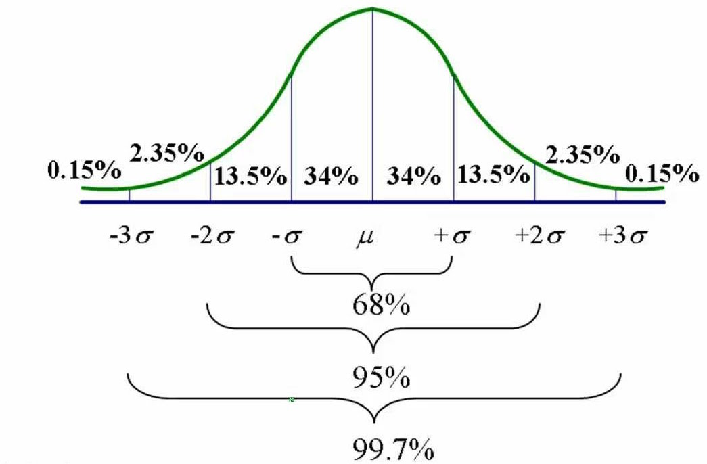
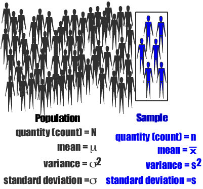
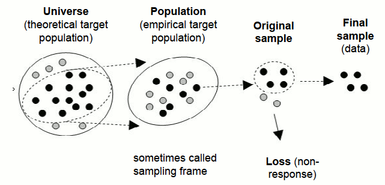
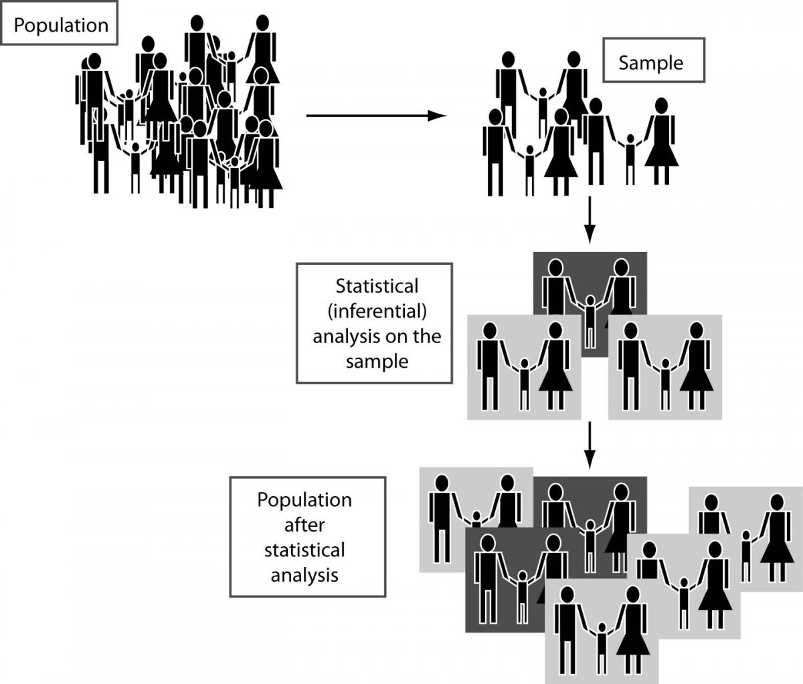

## Review: session 1 learning objectives

- Perform basic data manipulation/exploration in R and dplyr
    + load data from a csv file
    + generate random numbers using `sample()`
    + understand use of `set.seed()`
    + generate histograms
- Clone and contribute to the class [Github](https://github.com/waldronlab/AppStatTrento) repo
- Complete assignments using R Markdown
- Define random variables and distinguish them from non-random ones
- Recognize some important random distributions from their probability density plots:
    + Normal, Poisson, Negative Binomial, Binomial

## The Normal distribution

<center>

</center>

Mean: $\mu = \frac{1}{N}\sum_{i=1}^{N}x_i^2$  
Variance: $\sigma^2 = \frac{1}{N}\sum_{i=1}^{N}(x_i - \mu)^2$  
N = # in population

## Session 2 learning objectives: foundations of hypothesis testing

- Identify the difference between populations and samples
    + give sampling strategies
- Identify properties of a Normal distribution
- Define the Central Limit Theorem and give examples of its application

- Book sections:
    + Chapter 1 - Inference, up to and including "Central Limit Theorem and t-distribution"

# Population vs sample

## Population vs sample

<center>

</center>

- The numbered population is the _sampling frame_
- Sampling probability of every individual in the population must be non-zero
- We must know what the sampling probability is for every individual in the population

## Population vs sample (cont'd)

- The population distribution is specified by _parameters_
- Individuals in the population are sometimes referred to as a _record_, on which you make an _observation_
- A sample is summarized by a _statistic_
- The _statistic_ is used to make inference about the population

<center>

</center>

## Sampling strategies

- **Simple Random Sampling (SRS)**: each record sampled with equal probability

> - **Stratified Random Sampling**: records are sampled in planned numbers from pre-defined strata (usually better than Simple Random Sampling)
> - **Cluster Random Sampling**: clusters are randomly sampled from the population, then individuals randomly sampled from the clusters
> - **Complex Sampling**: a general term for designs with unequal sampling probability
> - **Convenience Sampling**: whatever records are easiest to observe

## Population size doesn't matter!

- A remarkable attribute of sampling:
    + as long as the population is large and you can obtain a random sample, it doesn't matter how big the population is. Only how big the sample is.
    + we normally treat the population as infinite

<center>

</center>
    
## Selection bias



- Selection bias may be introduced by differences between:
    - theoretical and empirical target populations
    - assumed and actual sampling probabilities
    - widespread and not clear how to account for

## How inferential statistics works

<center>

</center>


# Sampling distributions and the Central Limit Theorem

## What is a “sampling distribution?”

It is the distribution of a statistic for many samples taken from one population.
 
1. Take a sample from a population
2. Calculate the sample statistic (e.g. mean)
3. Repeat.  

- The values from (2) form a sampling distribution.

- Question: how is this different from a population distribution?

## Example: population and sampling distributions

We observe 100 counts from a Poisson distribution ($\lambda = 2$):

```{r, echo=FALSE, fig.height=3}
set.seed(1)
onesample=rpois(100, lambda=2)
xdens = seq(min(onesample), max(onesample), by=1)
ydens = length(onesample) * dpois(xdens, lambda=2)
par(mar=c(2, 4, 0.1, 0.1))
res=hist(onesample, main="", prob=FALSE, col="lightgrey", xlab="", ylim=c(0, max(ydens)),
     breaks=seq(-0.5, round(max(onesample))+0.5, by=0.5))
lines(xdens, ydens, lw=2)
```

Question: is this a population or a sampling distribution?

## Example: population and sampling distributions (cont'd)
- We calculate the *mean* of those 100 counts, and do the same for 1,000 more samples of 100:

```{r, echo=FALSE, fig.height=3}
set.seed(1)
samplingdistr=replicate(1000, mean(rpois(100, lambda=2)))
par(mar=c(4, 4, 0.1, 0.1))
res=hist(samplingdistr, xlab="Means of the 100-counts", main="")
dy=density(samplingdistr, adjust=2)
## Note this next step is just an empirical way to put the density line approximately the same scale as the histogram:
dy$y = dy$y / max(dy$y) * max(res$counts)
lines(dy)
```

Question: is this a population or a sampling distribution?

## Central Limit Theorem

The "CLT" relates the sampling distribution (of means) to the population distribution.

> 1. Mean of the population ($\mu$) and of the sampling distribution ($\bar{X}$) are identical
> 2. Standard deviation of the population ($\sigma$) is related to the standard deviation of the distribution of sample means (*Standard Error* or *SE*) by: 
$$
SE = \sigma / \sqrt{n}
$$
> 3. For large n, the shape of the sampling distribution of means becomes normal

## CLT 1: equal means

Recall Poisson distributed population and samples of n=30:

```{r, echo=FALSE, fig.height=4}
par(mfrow=c(1,2))
hist(onesample, main="One sample of 100 counts\n from Poisson(lambda=2)", xlab="counts")
abline(v=2, col="red", lw=2)
res=hist(samplingdistr, xlab="Means of the 100-counts", main="1000 samples\n of n=100")
abline(v=2, col="red", lw=2)
```

- Distributions are different, but means are the same

## CLT 2: Standard Error

Standard deviation of the sampling distribution is $SE = \sigma / \sqrt{n}$:

```{r, echo=FALSE, fig.height=4}
par(mfrow=c(1,3))
hist(replicate(1000, mean(rpois(30, lambda=2))), xlim=c(1.3, 3),
     xlab="Means of 30-counts", main="1000 samples\n of n=30")
abline(v=2, col="red", lw=2)
hist(replicate(1000, mean(rpois(100, lambda=2))), xlim=c(1.3, 3),
     xlab="Means of 100-counts", main="1000 samples\n of n=100")
abline(v=2, col="red", lw=2)
hist(replicate(1000, mean(rpois(500, lambda=2))), xlim=c(1.3, 3),
     xlab="Means of 500-counts", main="1000 samples\n of n=500")
abline(v=2, col="red", lw=2)
```

## CLT 3: large samples

- The distribution of means of large samples is normal. 
    + for large enough n, the population distribution doesn't matter. How large?
    + n < 30: population is normal or close to it
    + n >= 30: skew and outliers are OK
    + n > 500: even extreme population distributions

## CLT 3: large samples (cont'd)

* Example: an extremely skewed (log-normal) distribution:

```{r, echo=FALSE, fig.height=4}
par(mfrow=c(1,3))
set.seed(5)
onesample=rlnorm(n=100, sdlog=1.5)
hist(onesample, main="One sample of 100 observations\n from lognormal pop'n", xlab="counts")
sampling30=replicate(1000, mean(rlnorm(n=30, sdlog=1.5)))
hist(sampling30, xlab="Means of the 100 obs.", main="1000 samples\n of n=30")
sampling500=replicate(1000, mean(rlnorm(n=500, sdlog=1.5)))
hist(sampling500, xlab="Means of the 500 obs.", main="1000 samples\n of n=500")
```

# t-distribution

## What is the use of the t distribution

> * Recall from the CLT the sampling distribution is normal, with standard deviation $SE = \sigma / \sqrt{n}$:
    + For a normally distributed popluation, this holds for _any sample size n_
    + For non-normally distributed populations, it holds for _large n_
> * But, this formula assumes we know $\sigma$
    + if we instead estimate standard deviation from the sample ($s$), the sampling distribution is not normal
    + it has wider tails than the normal distribution

## What the t distribution looks like

```{r, echo=FALSE}
xdens = seq(-5, 5, by=0.01)
plot(xdens, dnorm(xdens), type="l", lwd=2)
abline(v=0); abline(h=0)
lines(xdens, dt(xdens, df=15), type="l", lwd=2, lty=1)
lines(xdens, dt(xdens, df=7), type="l", lwd=2, lty=2, col="blue")
lines(xdens, dt(xdens, df=3), type="l", lwd=3, lty=3, col="orange")
legend("topright", legend=c("N(mu=0, sd=1)", "t(df=15)", "t(df=7)", "t(df=3)"),
       lty=c(1, 1, 2, 3), lw=c(2,1,1,3), col=c("black", "black", "blue", "orange"))
```
*Question*: Why would such an apparently small difference from the normal distribution matter?

## When to use the t distribution

* Calculate the t-statistic for a sample: $t = \frac{\bar{X} - \mu_0}{s}$
* _if_ the population distribution is normal, or you have large sample size,
* _and_ you estimate standard deviation from a sample,
* THEN: the t-statistic is distributed as $t_{df=n-1}$

> * this leads to the one-sample t-test
> * _note_ the difference in the means of two samples also turns out to be t distributed when $s$ is estimated

## Why Hypothesis Testing?

- Hypothesis testing is not the only framework for inferential statistics, e.g.:
    - confidence intervals
    - posterior probabilities (Bayesian statistics)
    - read [p-values are just the tip of the iceberg](http://www.nature.com/news/statistics-p-values-are-just-the-tip-of-the-iceberg-1.17412)


## Lab exercises

1. [Populations, Samples, and Estimates](http://genomicsclass.github.io/book/pages/populations_and_samples_exercises.html)
2. [Central Limit Theorem and t-distribution](http://genomicsclass.github.io/book/pages/clt_and_t-distribution_exercises.html)

## Links

- A built [html][] version of this lecture is available.
- The [source][] R Markdown is also available from Github.
- A recording of the lecture will be available on the class [YouTube][] channel.

[html]: http://rpubs.com/lwaldron/TrentoSession2Lecture
[source]: https://github.com/lwaldron/AppStatTrento
[YouTube]: https://www.youtube.com/channel/UCwXiTYNRBUb_9r8-L4ziaGg