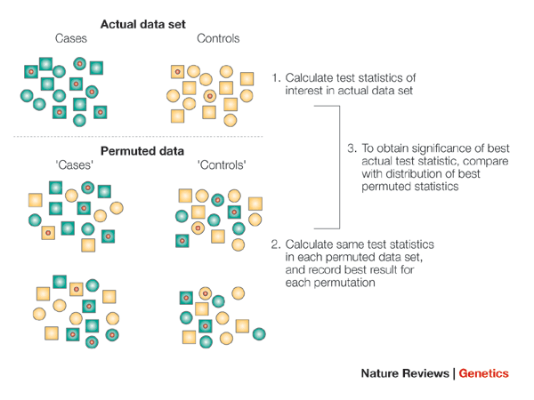
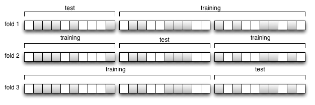
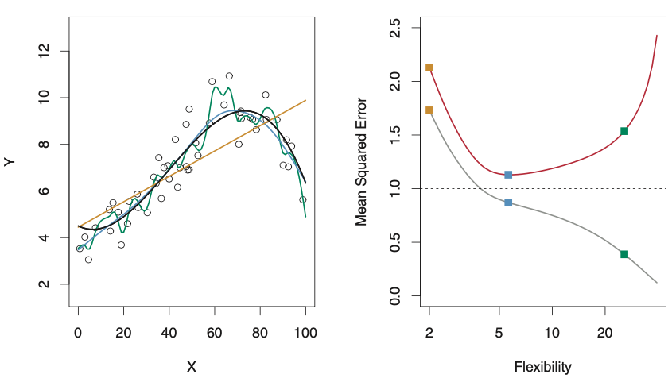
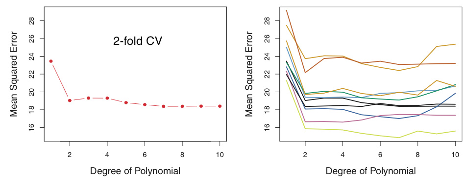
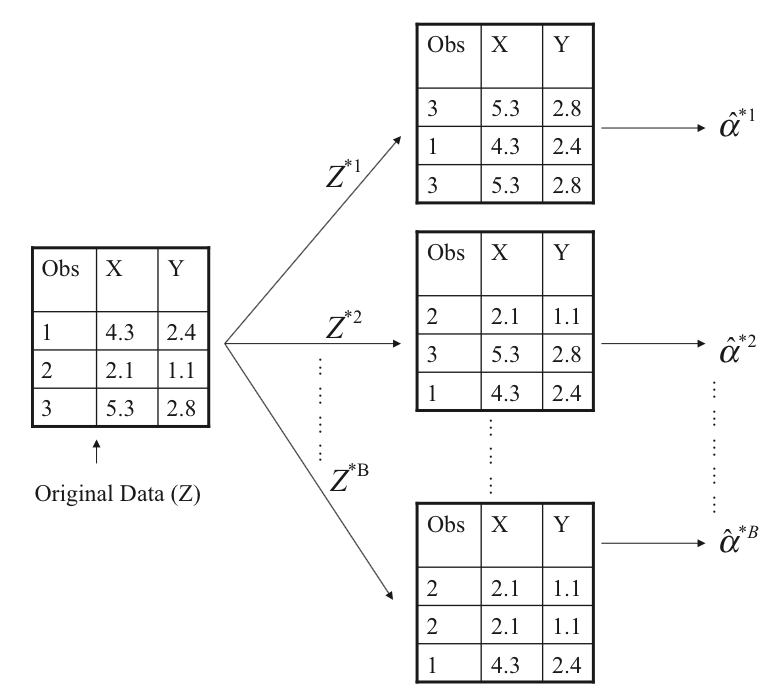

---
title: 'Applied Statistics for High-throughput Biology: Session 2'
author: "Levi Waldron"
output: slidy_presentation
---

```{r setup, include=FALSE}
knitr::opts_chunk$set(echo = TRUE, cache = TRUE)
```

## Session 2 outline

- Hypothesis testing for categorical variables
    - Fisher's Exact Test and Chi-square Test (["Association tests" book section](https://genomicsclass.github.io/book/pages/association_tests.html))

- Resampling methods
    + ["Permutation Tests" book section](https://genomicsclass.github.io/book/pages/permutation_tests.html)
    + [Cross-validation book section](https://genomicsclass.github.io/book/pages/crossvalidation.html)
    + bootstrap simulation (see Introduction to Statistical Learning section 5.2: https://www.statlearning.com/)

- [Exploratory data analysis](https://genomicsclass.github.io/book/pages/exploratory_data_analysis.html)

## Hypothesis testing for categorical variables

- Recall hypothesis testing and confidence intervals for one or two continuous variables: 
    - *Z-test, t-test, correlation*

- Two binary variables:
    - Fisher's Exact Test
    - Pearson's Chi-square Test

## Lady Tasting Tea

- The Lady in question claimed to be able to tell whether the tea or the milk was added first to a cup
- Fisher proposed to give her **eight** cups, **four** of each variety, in random order
    - the Lady is **fully informed** of the experimental method
    - $H_0$: the Lady has no ability to tell which was added first

<center>

</center>

Source: https://en.wikipedia.org/wiki/Lady_tasting_tea

## Fisher's Exact Test

p-value is the probability of the observed number of successes, or more, under $H_0$

<table>
<caption>Tea-Tasting Distribution</caption>
<tr>
<th scope="col">Success count</th>
<th scope="col">Permutations of selection</th>
<th scope="col">Number of permutations</th>
</tr>
<tr>
<td>0</td>
<td>oooo</td>
<td>1 × 1 = 1</td>
</tr>
<tr>
<td>1</td>
<td>ooox, ooxo, oxoo, xooo</td>
<td>4 × 4 = 16</td>
</tr>
<tr>
<td>2</td>
<td>ooxx, oxox, oxxo, xoxo, xxoo, xoox</td>
<td>6 × 6 = 36</td>
</tr>
<tr>
<td>3</td>
<td>oxxx, xoxx, xxox, xxxo</td>
<td>4 × 4 = 16</td>
</tr>
<tr>
<td>4</td>
<td>xxxx</td>
<td>1 × 1 = 1</td>
</tr>
<tr>
<th colspan="2" scope="row">Total</th>
<td>70</td>
</tr>
</table>

* x = correct, o = incorrect

What do you notice about all these combinations?

* Each only involves four guesses
* Without knowing how many cups had milk added first, there would be many more possible guesses

## Notes on Fisher's Exact Test

- Can also be applied to $r \times c$ tables
- Remember that the margins of the table are *fixed by design*
- One-tailed version (used in Gene Set Enrichment Analysis) is referred to as the Hypergeometric Test
- Exact p-values are difficult (and unnecessary) for large samples
    - `fisher.test(x, y = NULL, etc, simulate.p.value = FALSE)`

## Applications of Fisher's Exact Test

- Has been applied (with peril) to gene set analysis, e.g.:
    - 10 of my top 100 genes are annotated with the cytokinesis GO term
    - 465 of 21,000 human genes are annotated with the cytokinesis GO term
    - Are my top 100 genes enriched for cytokinesis process?
- Problems with this analysis:
    - Main problem: top-n genes tend to be correlated, so their selections are not independent trials
    - Secondary: does not match design for $H_0$

- There are many alternative approaches in Gene Set Analysis, but this approach isn't as bad as statisticians thought. See:

Geistlinger _et al._ Toward a gold standard for benchmarking gene set enrichment analysis. Brief. Bioinform. (2020) [doi:10.1093/bib/bbz158](http://dx.doi.org/10.1093/bib/bbz158)
    

## Chi-squared test

- Test of independence for $r \times c$ table (two categorical variables)
- Does not assume the margins are fixed by design
    - i.e., whether each cup of tea has milk poured first is determined by coin flip, and the Lady doesn't know how many
    - more common in practice
    - classic genomics example is GWAS
- $H_0$: the two variables are independent
- $H_A$: there is an association between the variables

## Application to GWAS

* Interested in association between disease and some potential causative factor
* In a case-control study, the numbers of cases and controls are fixed, but the other variable is not
* In a prospective or longitudinal cohort study, neither the number of cases or the other variable are fixed

```{r, echo=FALSE}
disease = factor(c(rep(0, 180), rep(1, 20), rep(0, 40), rep(1, 10)),
                 labels = c("control", "cases"))
genotype = factor(c(rep("AA/Aa", 204), rep("aa", 46)),
                  levels = c("AA/Aa", "aa"))
dat <- data.frame(disease, genotype)
set.seed(1)
dat <- dat[sample(nrow(dat)), ] #shuffle them up
summary(dat)
```

## Apply the chi-squared test

```{r}
table(disease, genotype)
chisq.test(disease, genotype)
chisq.test(disease, genotype, simulate.p.value = TRUE)
```

* Chisquare-test p-values are approximate, and inaccuracy increases with small cells in $r \times c$ tables (say, less than 5)
* $simulate.p.value$ is a more valid way to address small counts than using Fisher's Exact Test, if $H_0$ corresponds to a chi-square test
* Fisher's Exact Test provides an exact p-value for a different hypothesis

## Calculate odds ratio

* Note that the result says nothing about *how* the departure from independence occurs
* Odds ratios do

```{r}
library(epitools)
epitools::oddsratio(genotype, disease, method = "wald")$measure
```

## Note on factor reference levels

Use the `relevel()` function if you want to change the reference level of a factor, or `dplyr::recode_factor()`:

```{r}
epitools::oddsratio(relevel(genotype, "aa"), disease)$measure
```

(the default is whichever level is first alphabetically!)

## Summary - two categorical variables

- Choice between Fisher's Exact Test and Chi-square test is determined by experimental design
- If any counts in the table are less than 5, can use `simulate.p.value=TRUE` to get a more accurate p-value from the chi-square test
- Both assume independent observations (important!!)
- In a GWAS, correction for multiple testing is required

# Resampling methods

## Big classes of resampling methods

* Resampling involves simulating repeated samples from the one available sample
    - *Permutation tests*: shuffling labels to generate an empirical null distribution
    - *Cross-validation*: generate training and test sets _without_ replacement
    - *Bootstrap*: generate samples of size $n$, _with_ replacement

## Permutation test

Response (y) variable is permuted to guarantee true $H_0$:

<center>

</center>

<font size="2">
Genome-wide association studies for common diseases and complex traits. *Nature Reviews Genetics 6*, 95-108 (February 2005).
</font>

## Permutation test

- Calculate the test statistic for each permutation
    - 999 is a typical number
- P-value is the quantile of the real test statistic in the "empirical null distribution" of permutation test statistics
- Permutations tests *still have assumptions*: 
    - samples are assumed to be independent and “exchangeable”
    - hidden structure such as families can cause anti-conservative p-values

## K-fold cross-validation: setting

* Setting: prediction (as opposed to inference)
* Potential uses: 
    1. to tune a model to the data
    2. to avoid reporting inflated prediction accuracy due to over-fitting
    3. to compare the accuracy of competing algorithms in one dataset

<center>


Three-fold cross-validation

</center>

## Definitions: Training, Validation, Test

* The model is initially fit on a **training dataset**
* Successively, the fitted model is used to predict the responses for the observations in a second dataset called the **validation dataset**. The validation dataset might be used repeatedly for selecting from different models.
* Finally, the **test dataset** is a dataset used to provide an unbiased evaluation of a *final model* fit on the training dataset.

<font size="2">
https://en.wikipedia.org/wiki/Training,_validation,_and_test_sets
</font>

## Tuning: training set and validation set error

<center>


ISLR Figure 2.9: Training set vs. Validation set error: the U

</center>

* Training set error always decreased with more flexible models
* Validation set error tends to be U-shaped: model "tuning" searches for this low point
* Cross-validation for tuning does not equal cross-validation for estimating independent accuracy

<font size="2">
James, Witten, Hastie, Tibshirani.  An Introduction to Statistical Learning with Applications in R. Springer, 2014. https://www.statlearning.com/

FIGURE 2.9. Left: Data simulated from f, shown in black. Three estimates of f are shown: the linear regression line (orange curve), and two smoothing spline fits (blue and green curves). Right: Training MSE (grey curve), test MSE (red curve), and minimum possible test MSE over all methods (dashed line). Squares represent the training and test MSEs for the three fits shown in the left-hand panel.
</font>

## K-fold cross-validation: algorithm

* Create $K$ "folds" from the sample of size $n$, $K \le n$
1. Randomly sample $1/K$ observations (without replacement) as the validation set
2. Use remaining samples as the training set
3. Fit model on the training set, estimate accuracy on the validation set
4. Repeat $K$ times, not using the same validation samples
5. Average validation accuracy from each of the validation sets

## Variability in cross-validation

<center>


ISLR Figure 5.2: Variability in 2-fold cross-validation
</center>

* Repeating cross-validation many times then averaging the results is called _smoothing_.
* Simply choosing a different random training and validation set each time is called _Monte Carlo Cross-validation (MCCV)_

<font size="2">
James, Witten, Hastie, Tibshirani.  An Introduction to Statistical Learning with Applications in R. Springer, 2014. https://www.statlearning.com/

FIGURE 5.2. The validation set approach was used on the Auto data set in order to estimate the test error that results from predicting mpg using polynomial functions of horsepower. Left: Validation error estimates for a single split into training and validation data sets. Right: The validation method was repeated ten times, each time using a different random split of the observations into a training set and a validation set. This illustrates the variability in the estimated test MSE that results from this approach.

</font>

## Cross-validation summary

* In prediction modeling, we think of data as _training_ or _test_
     - cross-validation is a way to estimate test set error from a training set
* Training set error always decreases with more complex (flexible) models
* Test set error as a function of model flexibility tends to be U-shaped
     - the low point of the U represents the most appropriate amount of model complexity

## Summary of The Bootstrap

* The Bootstrap is a very general approach to estimating uncertainty, e.g. standard errors
* Can be applied to a wide range of models and statistics
* Robust to outliers and violations of model assumptions
* The basic approach:
    1. Using the available sample (size $n$), generate a new sample of size $n$ (with replacement)
    2. Calculate the statistic of interest
    3. Repeat
    4. Use repeated experiments to estimate the variability of your statistic of interest

## The Bootstrap (schematic)

<center>

</center>

# Exploratory data analysis

## Introduction

> “The greatest value of a picture is when it forces us to notice what we never expected to see.” - John W. Tukey

- Discover biases, systematic errors and unexpected variability in data
- Graphical approach to detecting these issues
- Represents a first step in data analysis and guides hypothesis testing
- Opportunities for discovery in the outliers

## Quantile Quantile Plots

- Quantiles divide a distribution into equally sized bins
- Division into 100 bins gives percentiles
- Quantiles of a theoretical distribution are plotted against an experimental distribution
    - alternatively, quantiles of two experimental distributions
- Given a perfect fit, $x=y$
- Useful in determining data distribution (normal, t, etc.)

## Example: Quantile Quantile Plots

```{r echo=FALSE, fig.width=8}
suppressPackageStartupMessages(library(UsingR))
suppressPackageStartupMessages(library(rafalib))
# height qq plot
x <- father.son$fheight
ps <- (seq(0, 99) + 0.5) / 100
qs <- quantile(x, ps)
normalqs <- qnorm(ps, mean(x), popsd(x))
par(mfrow = c(1, 3))
plot(normalqs,
     qs,
     xlab = "Normal Percentiles",
     ylab = "Height Percentiles",
     main = "Height Q-Q Plot")
abline(0, 1)
# t-distributed for 12 df
x <- rt(1000, 12)
qqnorm(x,
       xlab = "t quantiles",
       main = "T Quantiles (df=12) Q-Q Plot",
       ylim = c(-6, 6))
qqline(x)
# t-distributed for 3 df
x <- rt(1000, 3)
qqnorm(x,
       xlab = "t quantiles",
       main = "T Quantiles (df=3) Q-Q Plot",
       ylim = c(-6, 6))
qqline(x)
```

## Boxplots: About

- Provide a graph that is easy to interpret where data is not normally distributed
- Would be an appropriate choice to explore income data, as distribution is highly skewed
- Particularly informative in relation to outliers and range
- Possible to compare multiple distributions side by side

## Boxplots: Example

```{r echo=FALSE, fig.width=8, fig.height=4}
par(mfrow=c(1, 3))
hist(exec.pay, main = "CEO Compensation")
qqnorm(exec.pay, main = "CEO Compensation")
boxplot(exec.pay, ylab="10,000s of dollars", ylim=c(0,400), main = "CEO Compensation")
```
<center>
Three different views of a continuous variable
</center>

## Scatterplots And Correlation: About

- For two continuous variables, scatter plot and calculation of correlation is useful
- Provides a graphical and numeric estimation of relationships
- Quick and easy with `plot()` and `cor()`

## Scatterplots And Correlation: Example

```{r echo=FALSE, fig.width=8, fig.height=4}
par(mfrow=c(1,3))
plot(father.son$fheight, father.son$sheight,xlab="Father's height in inches",ylab="Son's height in inches",main=paste("correlation =",signif(cor(father.son$fheight, father.son$sheight),2)))
plot(cars$speed, cars$dist,xlab="Speed",ylab="Stopping Distance",main=paste("correlation =",signif(cor(cars$speed, cars$dist),2)))
plot(faithful$eruptions, faithful$waiting,xlab="Eruption Duration",ylab="Waiting Time",main=paste("correlation =",signif(cor(faithful$eruptions, faithful$waiting),2)))
```

## Exploratory data analysis in high dimensions

```{r, echo=FALSE, message=FALSE}
if(!require(GSE5859Subset)){
  BiocManager::install("genomicsclass/GSE5859Subset")
}
```

```{r}
library(GSE5859Subset)
data(GSE5859Subset) ##this loads three tables
c(class(geneExpression), class(sampleInfo))
rbind(dim(geneExpression), dim(sampleInfo))
head(sampleInfo)
```

## Volcano plots: Setup

T-test for every row (gene) of gene expression matrix:
```{r, message=FALSE}
library(genefilter)
g <- factor(sampleInfo$group)
system.time(results <- rowttests(geneExpression, g))
pvals <- results$p.value
```

Note that these 8,793 tests are done in about 0.01s

## Volcano plots: Example

```{r, fig.height=3, fig.width=6}
par(mar = c(4, 4, 0, 0))
plot(results$dm,
     -log10(results$p.value),
     xlab = "Effect size (difference in group means)",
     ylab = "- log (base 10) p-values")
abline(h = -log10(0.05 / nrow(geneExpression)), col = "red")
legend("bottomright",
       lty = 1,
       col = "red",
       legend = "Bonferroni = 0.05")
```

## Volcano plots: Summary

- Many small p-values with small effect size indicate low within-group variability
- Inspect for asymmetry
- Can color points by significance threshold

## P-value histograms: Setup

- If all null hypotheses are true, expect a flat histogram of p-values:

```{r}
m <- nrow(geneExpression)
n <- ncol(geneExpression)
set.seed(1)
randomData <- matrix(rnorm(n * m), m, n)
nullpvals <- rowttests(randomData, g)$p.value
```

## P-value histograms: Example

```{r, echo=FALSE, fig.height=3}
par(mfrow = c(1, 2))
hist(pvals, ylim = c(0, 1400))
hist(nullpvals, ylim = c(0, 1400))
```

## P-value histograms: Example 2 (permutation)

Note that permuting these data doesn't produce an ideal null p-value histogram due to batch effects:

```{r, fig.height=3}
permg <- sample(g)
permresults <- rowttests(geneExpression, permg)
hist(permresults$p.value)
```

## P-value histograms: Summary

- Give a quick look at how many significant p-values there may be
- When using permuted labels, can exposes non-independence among the samples
    + can be due to batch effects or family structure
- Most common approaches for correcting batch effects are:
    + `ComBat`: corrects for known batch effects by linear model), and 
    + `sva`: creates surrogate variables for unknown batch effects, corrects the structure of permutation p-values
    + correction using control (housekeeping) genes

All are available from the [sva](https://www.bioconductor.org/packages/sva) Bioconductor package

## MA plot

- just a scatterplot rotated 45$^o$

```{r, fig.height=3}
rafalib::mypar(1, 2)
pseudo <- apply(geneExpression, 1, median)
plot(geneExpression[, 1], pseudo)
plot((geneExpression[, 1] + pseudo) / 2, (geneExpression[, 1] - pseudo))
```

## MA plot: Summary

- useful for quality control of high-dimensional data
- plot all data values for a sample against another sample or a median "pseudosample"
- `affyPLM::MAplots` better MA plots
    - adds a smoothing line to highlight departures from horizontal line
    - plots a "cloud" rather than many data points

## Heatmaps

* Detailed representation of high-dimensional dataset.
    - `ComplexHeatmap` package is the best as of 2023: large datasets, interactive heatmaps, simple defaults but many customizations possible

```{r, fig.width=12}
suppressPackageStartupMessages(library(ComplexHeatmap))
keep <- rank(apply(geneExpression, 1, var)) <= 100  # 500 most variable genes
ge <- geneExpression[keep, ]
ge <- t(scale(t(ge))) #scale
rownames(ge) <- NULL; colnames(ge) <- NULL
chr <- sub("chr", "", geneAnnotation$CHR)
chr[is.na(chr)] <- "Un"
chr <- factor(chr, levels = c(1:22, "Un", "X", "Y"))
chrcols <- list(chromosome = c(colorRampPalette(c("lightgrey", "black"))(22), "white", "pink", "blue"))
names(chrcols[["chromosome"]]) <- c(1:22, "Un", "X", "Y")
row_ha <- rowAnnotation(chromosome = chr[keep], col = chrcols, na_col = "white")
column_ha <- HeatmapAnnotation(ethnicity = sampleInfo$ethnicity, group = factor(sampleInfo$group),
                               col = list(ethnicity = c("ASN"="lightgrey", "CEU"="darkgrey"),
                                          group = c("0" = "brown", "1" = "blue")))
Heatmap(ge, use_raster = FALSE, top_annotation = column_ha, right_annotation = row_ha)
```

## Heatmaps: Summary

- Clustering becomes slow and memory-intensivefor thousands of rows
    - probably too detailed for thousands of rows
- can show co-expressed genes, groups of samples

## Colors

- Types of color pallettes: 
    - **sequential**: shows a gradient
    - **diverging**: goes in two directions from a center
    - **qualitative**: for categorical variables
- Keep color blindness in mind (10% of all men)

## Colors (cont'd)

Combination of `RColorBrewer` package and `colorRampPalette()` can create anything you want

```{r, fig.height=5, echo=FALSE}
rafalib::mypar(1, 1)
RColorBrewer::display.brewer.all(n = 7)
```

## Plots To Avoid

> "Pie charts are a very bad way of displaying information." - R Help

- Always avoid pie charts
- Avoid doughnut charts too
- Avoid pseudo 3D and most Excel defaults
- Effective graphs use color judiciously

## Lab

* [Permutation Test exercises](https://genomicsclass.github.io/book/pages/permutation_tests_exercises.html)
* [Association Test exercises](https://genomicsclass.github.io/book/pages/association_tests_exercises.html)
* [EDA exercises **1-3 only**](https://genomicsclass.github.io/book/pages/exploratory_data_analysis_exercises.html)

## Links

- A built [html][] version of this lecture is available.
- The [source][] R Markdown is also available from Github.

[html]: https://rpubs.com/lwaldron/AppStatBio2023_day2
[source]: https://github.com/waldronlab/AppStatBio
