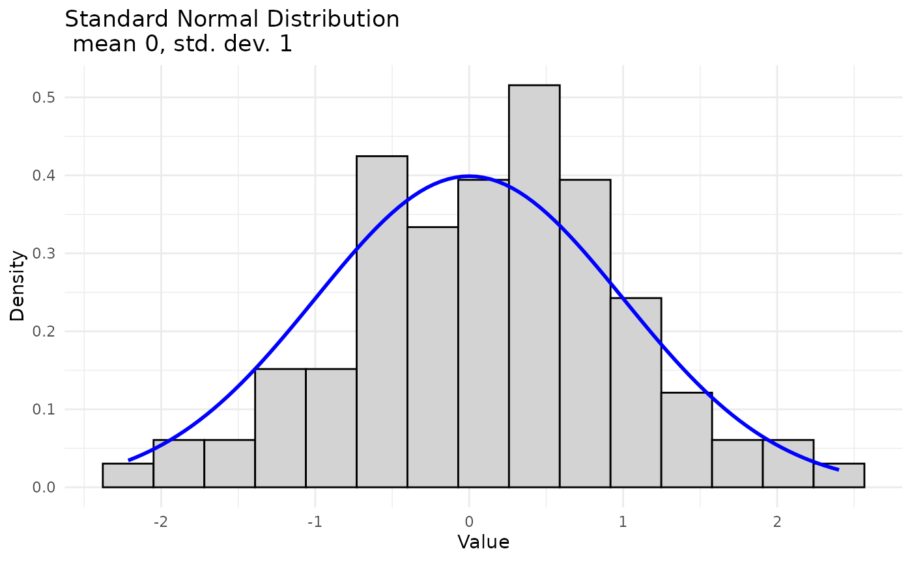
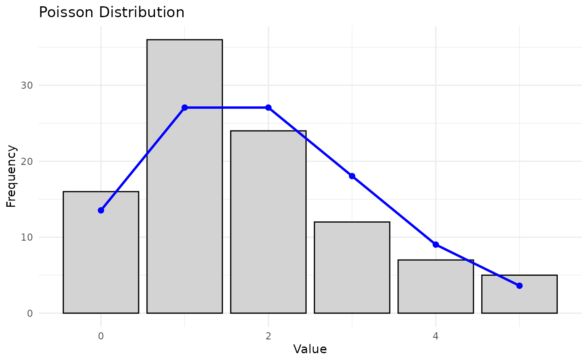
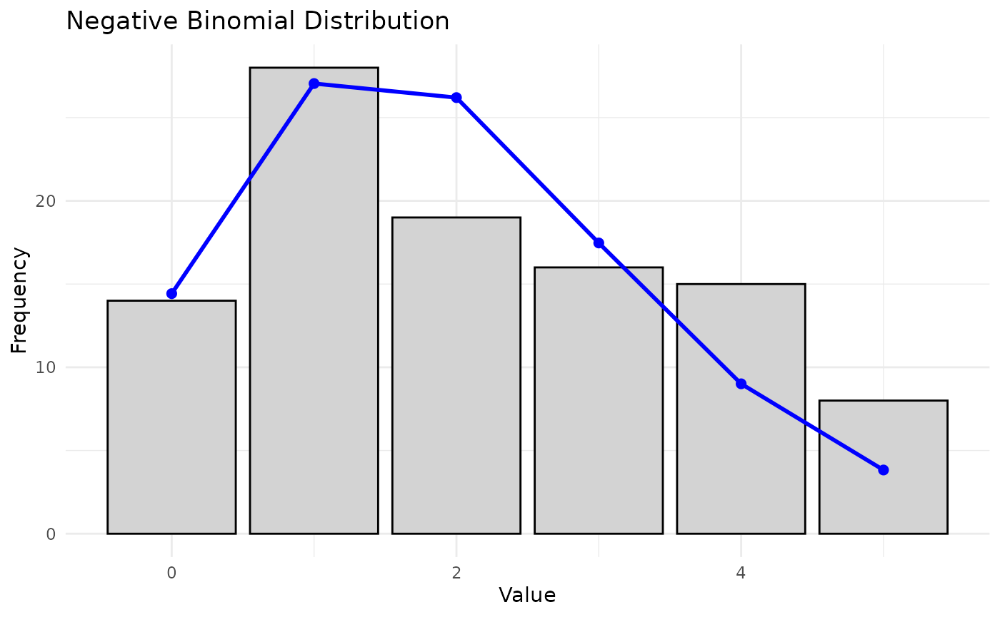
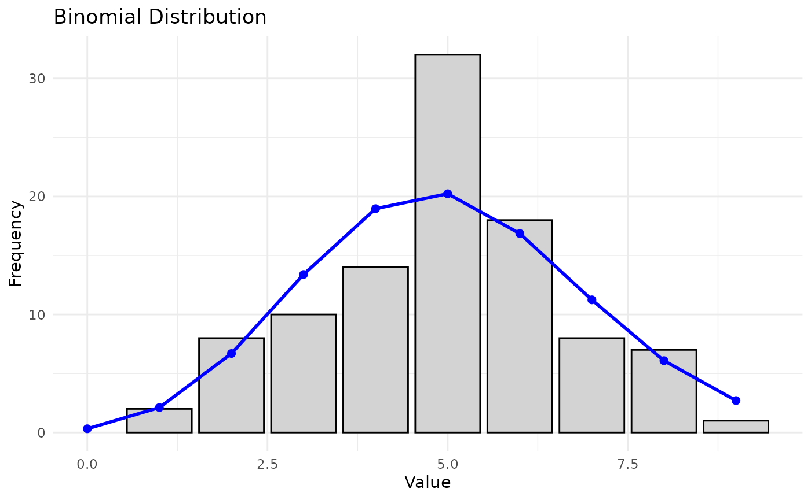
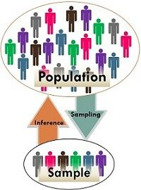
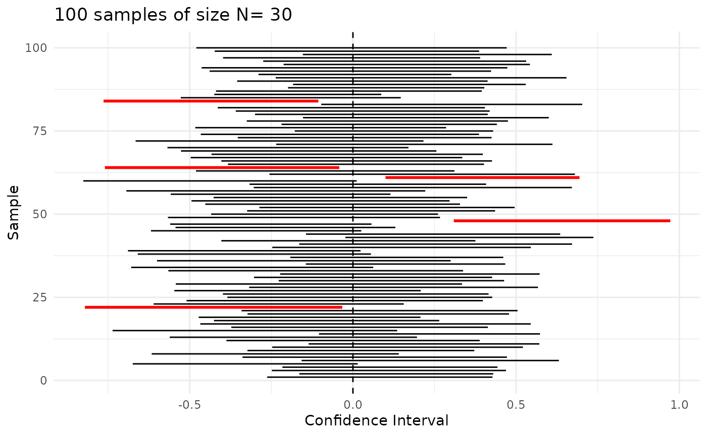
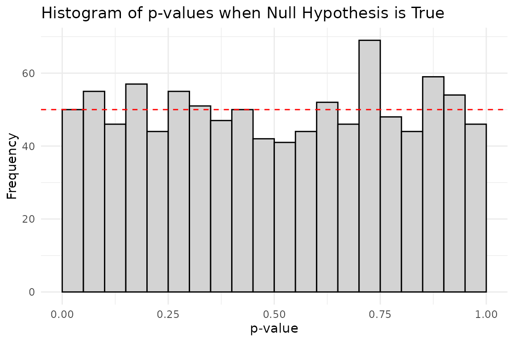
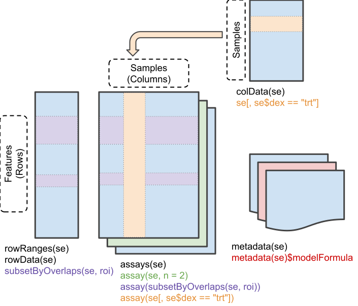

# Applied Statistics for High-throughput Biology: Session 1

## Front matter

### Welcome

My research interests:

- High-dimensional statistics (more variables than observations)
- Predictive modeling and methodology for validation
- Metagenomic profiling of the human microbiome
- Multi-omic data analysis for cancer
- <https://www.waldronlab.io>

### The textbooks

- [Biomedical Data Science](https://genomicsclass.github.io/book/) by
  Irizarry and Love ([ePub
  version](https://leanpub.com/dataanalysisforthelifesciences/) on
  Leanpub)
- [Source repository](https://github.com/genomicsclass/labs)
- [Modern Statistics for Modern
  Biology](https://www.huber.embl.de/msmb/) by Holmes and Huber
  (secondary)
- [Orchestrating Single-Cell Analysis with
  Bioconductor](https://bioconductor.org/books/release/OSCA/) (OSCA) by
  Amezquita, Lun, Hicks, Gottardo, O’Callaghan


Biomedical Data Science book cover

### Day 1 outline

- Random variables and distributions
- Hypothesis testing for one or two samples (t-test, Wilcoxon test, etc)
- Confidence intervals
- Essential data classes in R/Bioconductor
- [Book](https://genomicsclass.github.io/book/) chapters 0 and 1

### Learning objectives

- Define random variables and distinguish them from non-random ones
- Distinguish population from sampling distributions
- Identify scenarios for use of z-test and t-tests
- Interpret confidence intervals and Standard Error
- Identify and interrogate key R/Bioconductor data classes

## Random Variables and Distributions

### Random Variables

- **A random variable**: any characteristic that can be measured or
  categorized, and where any particular outcome is determined at least
  partially by chance.

- Examples:

  - number of new diabetes cases in population in a given year
  - The weight of a randomly selected individual in a population

- Types:

  - Categorical random variable (e.g. disease / healthy)
  - Discrete random variable (e.g. sequence read counts)
  - Continuous random variable (e.g. normalized qPCR intensity)

### Random Variables - examples

Normally distributed random variable with mean $`\mu = 0`$ / standard
deviation $`\sigma = 1`$, and a sample of $`n=100`$



### Random Variables - examples

Poisson distributed random variable ($`\lambda = 2`$), and a sample of
$`n=100`$.



### Random Variables - examples

Negative Binomially distributed random variable ($`size=30, \mu=2`$),
and a sample of $`n=100`$.



### Random Variables - examples

- Binomial Distribution random variable ($`size=20, prob=0.25`$), and a
  sample of $`n=100`$.
  - use for binary outcomes



## Hypothesis Testing

### Why hypothesis testing?

- Allows yes/no statements, e.g. whether:
  - a population mean has a hypothesized value, or
  - an intervention causes a measurable effect relative to a control
    group
- Example questions with yes/no answers:
  - Is a gene differentially expressed between two populations?
  - Do hypertensive, smoking men have the same mean cholesterol level as
    the general population?
- Hypothesis testing is not the only framework for inferential
  statistics, e.g.:
  - confidence intervals
  - posterior probabilities (Bayesian statistics)
  - read [p-values are just the tip of the
    iceberg](http://www.nature.com/news/statistics-p-values-are-just-the-tip-of-the-iceberg-1.17412)

### Logic of hypothesis testing

- Hypotheses are made about *populations* based on inference from
  *samples*
- We make inference from *samples* because we usually cannot observe the
  entire population



Sample vs Population

Source:
<https://keydifferences.com/wp-content/uploads/2016/06/population-vs-sample2.jpg>

### One and two-sample hypothesis tests of mean

**One-sample hypothesis test of mean** - sample comes from one of two
population distributions:

1.  usual distribution that has been true in the past
    - $`H_0: \mu = \mu_0`$ (null hypothesis)
2.  a potentially new distribution induced by an intervention or
    changing condition
    - $`H_A: \mu \neq \mu_0`$ (alternative hypothesis)

**Two-sample hypothesis test of means** - two samples are drawn, either:

1.  from a single population
    - $`H_0: \mu_1 = \mu_2`$ (null hypothesis)
2.  from two different populations
    - $`H_A: \mu_1 \neq \mu_2`$ (alternative hypothesis)

### Population vs sampling distributions

- Population distributions
  - Each realization / point is an individual
- Sampling distributions
  - Each realization / point is a sample
  - distribution depends on sample size
  - large sample distributions are given by the Central Limit Theorem
- **Hypothesis testing is about sampling distributions**
  - Did my sample likely come from that distribution?

### Note about the Central Limit Theorem

When sample size is large, the average $`\bar{Y}`$ of a random sample:

1.  Follows a normal distribution
2.  The normal distribution has mean entered at the population average
    $`\mu_Y`$
3.  with standard deviation equal to the population standard deviation
    $`\sigma_Y`$, divided by the square root of the sample size $`N`$.
    We refer to the standard deviation of the distribution of a random
    variable as the random variable’s *standard error*.

Thanks to CLT, linear modeling, t-tests, ANOVA are all guaranteed to
work reasonably well for large samples (more than ~30 observations).

Go to online demo: <http://onlinestatbook.com/stat_sim/sampling_dist/>

### Example applications of hypothesis tests for continuous variables

1.  Do study participants on a diet lose weight compared to a control
    group?
2.  Does a gene knockout result in less viable cell colonies, as
    measured by the number of living cells in replicate experiments?
3.  Is *Prevotella copri* more abundant in the guts of vegans than of
    meat-eaters?
4.  Do infants born in this region have a higher birthweight than the
    national average?

These are research hypotheses. What are the corresponding *null
hypotheses*?

### The z-tests

- “$`z`$” refers to the **Standard Normal Distribution**:
  $`N(\mu=0, \sigma=1)`$
- In a one-sample test, only a single sample is drawn:
  - $`H_0: \mu = \mu_0`$
- In a two-sample test, two samples are drawn *independently*:
  - $`H_0: \mu_1 = \mu_2`$
- A paired test is one sample of paired measurements, e.g.:
  - pain level in individuals before and after treatment
    - $`H_0: \mu_{before} = \mu_{after}`$
  - microbial abundance in upper and lower intestines in same
    individuals
    - $`H_0: \mu_{upper} = \mu_{lower}`$

### When to use z-tests

- $`\frac{{}\bar{x} - \mu}{\sigma}`$ and
  $`\frac{\bar{x_1} - \bar{x_2}}{\sigma}`$ are z-distributed *if*:
  - **the standard deviation $`\sigma`$ for the population is known in
    advance**
  - the population values are normally distributed
  - the population values are slightly skewed but n \> 15
  - the population values are quite skewed but n \> 30

### Example of one-sample z-test

``` r

library(TeachingDemos)
set.seed(1)
(weights = rnorm(10, mean = 75, sd = 10))
#>  [1] 68.73546 76.83643 66.64371 90.95281 78.29508 66.79532 79.87429 82.38325
#>  [9] 80.75781 71.94612
TeachingDemos::z.test(
    x = weights,
    mu = 70,  #specified for population under H0 because this is a one-sample test
    stdev = 10, #specified for population because this is a z-test
    alternative = "two.sided"
)
#> 
#>  One Sample z-test
#> 
#> data:  weights
#> z = 1.9992, n = 10.0000, Std. Dev. = 10.0000, Std. Dev. of the sample
#> mean = 3.1623, p-value = 0.04559
#> alternative hypothesis: true mean is not equal to 70
#> 95 percent confidence interval:
#>  70.12408 82.51998
#> sample estimates:
#> mean of weights 
#>        76.32203
```

### The t-tests

- The t-tests are for small samples and do *not* rely on the Central
  Limit Theorem
- In a one-sample test, only a single sample is drawn:
  - $`H_0: \mu = \mu_0`$
- In a two-sample test, two samples are drawn *independently*:
  - $`H_0: \mu_1 = \mu_2`$
- A paired test is one sample of paired measurements, e.g.:
  - individuals before and after treatment

### When to use t-tests

- $`\frac{{}\bar{x} - \mu}{s}`$ and $`\frac{\bar{x_1} - \bar{x_2}}{s}`$
  are t-distributed *if*:
  - **the standard deviation $`s`$ is estimated from the sample**
  - the population values are normally distributed
  - the population values are slightly skewed but n \> 15
  - the population values are quite skewed but n \> 30
- Wilcoxon tests are an alternative for non-normal populations
  - e.g. rank data
  - data where ranks are more informative than means
  - *not* when many ranks are arbitrary

### Example of one-sample t-test

Note that here we do not specify the standard deviation, because it is
estimated from the sample.

``` r

stats::t.test(
    x = weights,
    mu = 70,  #specified for population under H0 because this is a one-sample test
    alternative = "two.sided"
)
#> 
#>  One Sample t-test
#> 
#> data:  weights
#> t = 2.5612, df = 9, p-value = 0.03063
#> alternative hypothesis: true mean is not equal to 70
#> 95 percent confidence interval:
#>  70.73805 81.90600
#> sample estimates:
#> mean of x 
#>  76.32203
```

In this particular example the p-value is smaller than from the
*z-test*, but in general it would be **less powerful** than a *z-test*
if its assumptions are met.

## Confidence intervals

### Why confidence intervals?

- The above procedures produced both p-values and confidence intervals
- p-values are useful only for deciding whether to reject $`H_0`$
- p-values do not report effect size (observed difference).
- p-values only indicate statistical significance which does not
  guarantee scientific/clinical significance.

Confidence intervals provide a **probable range for the true population
mean**.



### Intervals for any confidence level

- If the sampling distribution is normal with standard error $`SE`$,
  then a confidence interval for the population mean is:
  - $`\bar{X} \pm 1.96 \times SE`$ (95% CI, normal sampling
    distribution)
  - $`\bar{X} \pm z_{\alpha / 2}^{crit} \times SE`$ (normal sampling
    distribution)
  - $`\bar{X} \pm t_{\alpha / 2, df}^{crit} \times SE`$ (t sampling
    distribution)
- The part after the $`\pm`$ is called the *margin of error*

### Confidence intervals vs. hypothesis testing

- Confidence intervals can be used for hypothesis testing
  - reject $`H_0`$ if the “null value” is not contained in the CI
- Do **not** use overlap between two CIs for hypothesis test
  - for a two sample hypothesis test $`H_0: \mu_1 = \mu_2`$, must
    construct a single confidence interval for $`\mu_1 - \mu_2`$

### Q & A: confidence intervals

Which of the following are true?

- The 95% CI contains 95% of the values in the population
- The 95% CI will contain the population mean, 19 times out of 20
- The 95% CI is 95% probable to contain the population mean
- The 99% CI will be wider than the 95% CI

## Summary - hypothesis testing

### Power and type I and II error

| True state of nature | Result of test |  |
|----|----|----|
|  | **Reject $`H_0`$** | **Fail to reject $`H_0`$** |
| $`H_0`$ TRUE | Type I error, probability = $`\alpha`$ | No error, probability = $`1-\alpha`$ |
| $`H_0`$ FALSE | No error, probability is called power = $`1-\beta`$ | Type II error, probability = $`\beta`$ (false negative) |

### Use and mis-use of the p-value

- The p-value is the probability of observing a sample statistic *as or
  more extreme* as you did, *assuming that $`H_0`$ is true*
- The p-value is a **random variable**:
  - **don’t** treat it as precise.
  - **don’t** do silly things like try to interpret differences or
    ratios between p-values
  - **don’t** lose track of test assumptions such as independence of
    observations
  - **do** use a moderate p-value cutoff, then use some effect size
    measure for ranking
- Small p-values are particularly:
  - variable under repeated sampling, and
  - sensitive to test assumptions

### Distribution of p-values under the null hypothesis

When the null hypothesis is true, p-values are uniformly distributed
between 0 and 1. This means that even if there is no true effect, we
will still observe p-values \< 0.05 in 5% of our tests purely by chance.



### Use and mis-use of the p-value (cont’d)

- If we fail to reject $`H_0`$, is the probability that $`H_0`$ is true
  equal to ($`1-\alpha`$)? (Hint: NO NO NO!)
  - Failing to reject $`H_0`$ does not mean $`H_0`$ is true
  - “No evidence of difference $`\neq`$ evidence of no difference”
- Statistical significance vs. practical significance
  - As sample size increases, point estimates such as the mean are more
    precise
  - With large sample size, small differences in means may be
    statistically significant but not practically significant
- Although $`\alpha = 0.05`$ is a common cut-off for the p-value, there
  is no set border between “significant” and “insignificant,” only
  increasingly strong evidence against $`H_0`$ (in favor of $`H_A`$) as
  the p-value gets smaller.

## R - basic usage

### Tips for learning R

| Pseudo code                                   | Example code             |
|-----------------------------------------------|--------------------------|
| library(packagename)                          | library(dplyr)           |
| ?functionname                                 | ?select                  |
| ?package::functionname                        | ?dplyr::select           |
| ? ‘Reserved keyword or symbol’                | ? ‘%\>%’                 |
| ??searchforpossiblyexistingfunctionandortopic | ??simulate               |
| help(package = “loadedpackage”)               | help(“dplyr”)            |
| browseVignettes(“packagename”)                | browseVignettes(“dplyr”) |

Slide credit: Marcel Ramos

### Installing Packages the Bioconductor Way

- See the [Bioconductor](http://www.bioconductor.org/install) site for
  more info

Pseudo code:

``` r

install.packages("BiocManager") #from CRAN
packages <- c("packagename", "githubuser/repository", "biopackage")
BiocManager::install(packages)
BiocManager::valid()  #check validity of installed packages
```

- Works for CRAN, GitHub, and Bioconductor packages!

## Introduction to the R/Bioconductor data classes

### Base R Data Types: atomic vectors

`numeric` (set seed to sync random number generator):

``` r

set.seed(1)
rnorm(5)
#> [1] -0.6264538  0.1836433 -0.8356286  1.5952808  0.3295078
```

`integer`:

``` r

sample(1L:5L)
#> [1] 3 5 1 4 2
```

`logical`:

``` r

1:3 %in% 3
#> [1] FALSE FALSE  TRUE
```

`character`:

``` r

c("yes", "no")
#> [1] "yes" "no"
```

`factor`:

``` r

factor(c("yes", "no"))
#> [1] yes no 
#> Levels: no yes
```

For real-life recoding of factors, try
[`dplyr::recode`](https://dplyr.tidyverse.org/reference/recode.html),
[`dplyr::recode_factor`](https://dplyr.tidyverse.org/reference/recode.html)

### Base R Data Types: missingness

- Missing Values and others - **IMPORTANT**

``` r

c(NA, NaN, -Inf, Inf)
#> [1]   NA  NaN -Inf  Inf
```

[`class()`](https://rdrr.io/r/base/class.html) to find the class of a
variable.

### Base R Data Types: matrix, list, data.frame

`matrix`:

``` r

matrix(1:9, nrow = 3)
#>      [,1] [,2] [,3]
#> [1,]    1    4    7
#> [2,]    2    5    8
#> [3,]    3    6    9
```

The `list` is a non-atomic vector:

``` r

measurements <- c(1.3, 1.6, 3.2, 9.8, 10.2)
parents <- c("Parent1.name", "Parent2.name")
my.list <- list(measurements, parents)
my.list
#> [[1]]
#> [1]  1.3  1.6  3.2  9.8 10.2
#> 
#> [[2]]
#> [1] "Parent1.name" "Parent2.name"
```

The `data.frame` has list-like and matrix-like properties:

``` r

x <- 11:16
y <- seq(0, 1, .2)
z <- c("one", "two", "three", "four", "five", "six")
a <- factor(z)
my.df <- data.frame(x, y, z, a, stringsAsFactors = FALSE)
```

### Bioconductor S4 vectors: DataFrame

- Bioconductor (www.bioconductor.org) defines its own set of vectors
  using the S4 formal class system `DqtqFrame`: like a `data.frame` but
  more flexible. columns can be any atomic vector type:
  - `GenomicRanges` objects
  - `Rle` (run-length encoding)

``` r

suppressPackageStartupMessages(library(S4Vectors))
df <- DataFrame(var1 = Rle(c("a", "a", "b")),
                var2 = 1:3)
metadata(df) <- list(parent = "DataFrame is my virtual parent")
df
#> DataFrame with 3 rows and 2 columns
#>    var1      var2
#>   <Rle> <integer>
#> 1     a         1
#> 2     a         2
#> 3     b         3
```

### DataFrame is actually a virtual classes

- Rationale: Methods defined on `DFrame` are shared by all classes
  inheriting it
- See:
  <https://bioconductor.org/help/course-materials/2019/BiocDevelForum/02-DataFrame.pdf>
- See also:
  <https://github.com/Bioconductor/S4Vectors/issues/90#issue-1026425148>

### List and derived classes

``` r

List(my.list)
#> List of length 2
str(List(my.list))
#> Formal class 'SimpleList' [package "S4Vectors"] with 4 slots
#>   ..@ listData       :List of 2
#>   .. ..$ : num [1:5] 1.3 1.6 3.2 9.8 10.2
#>   .. ..$ : chr [1:2] "Parent1.name" "Parent2.name"
#>   ..@ elementType    : chr "ANY"
#>   ..@ elementMetadata: NULL
#>   ..@ metadata       : list()
```

``` r

suppressPackageStartupMessages(library(IRanges))
IntegerList(var1 = 1:26, var2 = 1:100)
#> IntegerList of length 2
#> [["var1"]] 1 2 3 4 5 6 7 8 9 10 11 12 13 14 15 16 17 18 19 20 21 22 23 24 25 26
#> [["var2"]] 1 2 3 4 5 6 7 8 9 10 11 12 ... 89 90 91 92 93 94 95 96 97 98 99 100
CharacterList(var1 = letters[1:100], var2 = LETTERS[1:26])
#> CharacterList of length 2
#> [["var1"]] a b c d e f g h i j ... <NA> <NA> <NA> <NA> <NA> <NA> <NA> <NA> <NA>
#> [["var2"]] A B C D E F G H I J K L M N O P Q R S T U V W X Y Z
LogicalList(var1 = 1:100 %in% 5, var2 = 1:100 %% 2)
#> LogicalList of length 2
#> [["var1"]] FALSE FALSE FALSE FALSE TRUE FALSE ... FALSE FALSE FALSE FALSE FALSE
#> [["var2"]] TRUE FALSE TRUE FALSE TRUE FALSE ... FALSE TRUE FALSE TRUE FALSE
```

### Biostrings

``` r

suppressPackageStartupMessages(library(Biostrings))
bstring <- BString("I am a BString object")
bstring
#> 21-letter BString object
#> seq: I am a BString object
```

``` r

dnastring <- DNAString("TTGAAA-CTC-N")
dnastring
#> 12-letter DNAString object
#> seq: TTGAAA-CTC-N
str(dnastring)
#> Formal class 'DNAString' [package "Biostrings"] with 5 slots
#>   ..@ shared         :Formal class 'SharedRaw' [package "XVector"] with 2 slots
#>   .. .. ..@ xp                    :<pointer: (nil)> 
#>   .. .. ..@ .link_to_cached_object:<environment: 0x558bfffe4090> 
#>   ..@ offset         : int 0
#>   ..@ length         : int 12
#>   ..@ elementMetadata: NULL
#>   ..@ metadata       : list()
```

``` r

alphabetFrequency(dnastring, baseOnly=TRUE, as.prob=TRUE)
#>          A          C          G          T      other 
#> 0.25000000 0.16666667 0.08333333 0.25000000 0.25000000
```

### (Ranged)SummarizedExperiment

 \* Source:
<https://bioconductor.org/packages/SummarizedExperiment/>

### (Ranged)SummarizedExperiment in Practice

- `SummarizedExperiment` is the *de facto* standard for “rectangular”
  data with metadata
- Let’s build a real `SummarizedExperiment` using the tissue gene
  expression data:

``` r

suppressPackageStartupMessages(library(SummarizedExperiment))
# We can use the genomicsclass tissuesGeneExpression data
suppressPackageStartupMessages(library(tissuesGeneExpression))
data(tissuesGeneExpression)

# Create the SummarizedExperiment object
se <- SummarizedExperiment(
    assays = list(counts = e),
    colData = DataFrame(tissue = tissue),
    rowData = DataFrame(gene_id = rownames(e))
)
se
#> class: SummarizedExperiment 
#> dim: 22215 189 
#> metadata(0):
#> assays(1): counts
#> rownames(22215): 1007_s_at 1053_at ... 91920_at 91952_at
#> rowData names(1): gene_id
#> colnames(189): GSM11805.CEL.gz GSM11814.CEL.gz ... GSM307640.CEL.gz
#>   GSM307641.CEL.gz
#> colData names(1): tissue
```

- We can directly access the expression matrix
  ([`assay()`](https://rdrr.io/pkg/SummarizedExperiment/man/SummarizedExperiment-class.html)),
  sample metadata
  ([`colData()`](https://rdrr.io/pkg/SummarizedExperiment/man/SummarizedExperiment-class.html)),
  and feature metadata
  ([`rowData()`](https://rdrr.io/pkg/SummarizedExperiment/man/SummarizedExperiment-class.html)):

``` r

dim(assay(se))
#> [1] 22215   189
head(colData(se), 3)
#> DataFrame with 3 rows and 1 column
#>                      tissue
#>                 <character>
#> GSM11805.CEL.gz      kidney
#> GSM11814.CEL.gz      kidney
#> GSM11823.CEL.gz      kidney
```

- Extended by `SingleCellExperiment`, `DESeqDataSet`
- Emulated by `MultiAssayExperiment`

### Lab Exercises and Links

- Lab Exercises
  - [OSCA Introduction Chapter 3: Getting scRNA-seq
    datasets](http://bioconductor.org/books/release/OSCA.intro/getting-scrna-seq-datasets.md).
    Also note the
    [TENxIO](https://www.bioconductor.org/packages/TENxIO/) package.
  - [OSCA Introduction Chapter 4: The SingleCellExperiment
    class](http://bioconductor.org/books/release/OSCA.intro/the-singlecellexperiment-class.md)
- Links
  - A built
    [html](https://waldronlab.io/AppStatBio/articles/day1_intro.html)
    version of this lecture is available.
  - The
    [source](https://github.com/waldronlab/AppStatBio/blob/main/vignettes/day1_intro.Rmd)
    R Markdown is also available from Github.
