# Applied Statistics for High-throughput Biology Session 2: Unsupervised Learning & Dimensionality Reduction

## Day 2 outline

[Book](https://genomicsclass.github.io/book/) chapter 8:

- Distances in high dimensions
- Principal Components Analysis and Singular Value Decomposition
- Multidimensional Scaling
- t-SNE and UMAP

## Schematic of a typical scRNA-seq analysis workflow

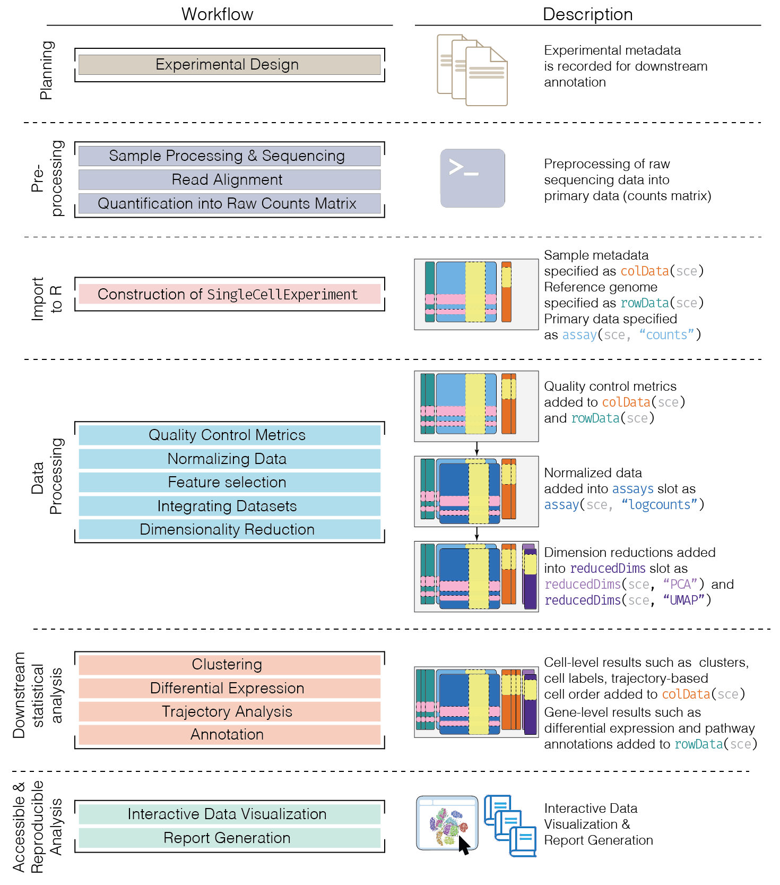

Single-cell workflow

Each stage (separated by dashed lines) consists of a number of specific
steps, many of which operate on and modify a SingleCellExperiment
instance. ([original
image](http://bioconductor.org/books/3.17/OSCA.intro/))

## Metrics and distances

A **metric** is a function that defines a distance between elements of a
set and satisfies five key properties:

1.  **Non-negativity:** The distance from point A to point B is always
    non-negative ($`d(a, b) \ge 0`$).
2.  **Symmetry:** The distance from A to B is the same as the distance
    from B to A ($`d(a, b) = d(b, a)`$).
3.  **Identity of indiscernibles:** The distance from a point to itself
    is zero ($`d(a, a) = 0`$).
4.  **Definiteness:** The distance is zero if and only if the points are
    the same ($`d(a, b) = 0 \iff a=b`$).
5.  **Triangle Inequality:** The distance from A to C is never greater
    than the sum of the distances from A to B and B to C
    ($`d(a, c) \le d(a, b) + d(b, c)`$).

- A **distance** is a more general term, typically required to satisfy
  only the first three properties.
- A **similarity function** also satisfies non-negativity and symmetry,
  but its value **increases** as two objects become more alike.
- A **dissimilarity function** is similar, but its value **decreases**
  as objects become more alike.

## Euclidian distance (metric)

- Remember grade school:
  
  Euclidean d = $`\sqrt{ (A_x-B_x)^2 + (A_y-B_y)^2}`$.
- **Side note**: also referred to as *$`L_2`$ norm*

## Euclidian distance in high dimensions

This familiar concept from geometry extends directly into higher
dimensions, which is essential for analyzing complex biological
datasets.

``` r

## BiocManager::install("genomicsclass/tissuesGeneExpression") #if needed
## BiocManager::install("genomicsclass/GSE5859") #if needed
library(GSE5859)
library(tissuesGeneExpression)
data(tissuesGeneExpression)

# Modern approach: store expression and metadata together
sce <- SingleCellExperiment(
  assays = list(logcounts = e),
  colData = S4Vectors::DataFrame(tissue = tissue)
)
dim(sce) ## gene expression data
#> [1] 22215   189
table(sce$tissue) ## samples per tissue
#> 
#>  cerebellum       colon endometrium hippocampus      kidney       liver 
#>          38          34          15          31          39          26 
#>    placenta 
#>           6
```

Interested in identifying similar *samples* and similar *genes*

## Notes about Euclidian distance in high dimensions

- Points are no longer on the Cartesian plane
- instead they are in higher dimensions. For example:
  - sample $`i`$ is defined by a point in 22,215 dimensional space:
    $`(Y_{1,i},\dots,Y_{22215,i})^\top`$.
  - feature $`g`$ is defined by a point in 189 dimensions
    $`(Y_{g,1},\dots,Y_{g,189})^\top`$

Euclidean distance as for two dimensions. E.g., the distance between two
samples $`i`$ and $`j`$ is:

``` math
 \text{dist}(i,j) = \sqrt{ \sum_{g} (Y_{g,i}-Y_{g,j})^2 } 
```

where the sum runs over all $`g = 1, \dots, 22215`$ genes, and the
distance between two features $`h`$ and $`g`$ is:

``` math
 \text{dist}(h,g) = \sqrt{ \sum_{i} (Y_{h,i}-Y_{g,i})^2 } 
```

where the sum runs over all $`i = 1, \dots, 189`$ samples.

## Euclidian distance in matrix algebra notation

The Euclidian distance between samples $`i`$ and $`j`$ can be written
as:

``` math
 \text{dist}(i,j) = \sqrt{ (\mathbf{Y}_i - \mathbf{Y}_j)^\top(\mathbf{Y}_i - \mathbf{Y}_j) }
```

with $`\mathbf{Y}_i`$ and $`\mathbf{Y}_j`$ columns $`i`$ and $`j`$.

``` r

t(matrix(1:3, ncol = 1))
#>      [,1] [,2] [,3]
#> [1,]    1    2    3
matrix(1:3, ncol = 1)
#>      [,1]
#> [1,]    1
#> [2,]    2
#> [3,]    3
t(matrix(1:3, ncol = 1)) %*% matrix(1:3, ncol = 1)
#>      [,1]
#> [1,]   14
```

## Note about matrix algebra in R

- “Stock” R may use an unoptimized `LAPACK` for matrix algebra. Large
  speed gains may be made by compiling against:
  - [OpenBLAS](https://www.openblas.net/)
  - [Intel Math Kernel
    Library](https://software.intel.com/content/www/us/en/develop/tools/oneapi/components/onemkl.html)
  - [Apple Accelerate Framework
    (macOS)](https://developer.apple.com/documentation/accelerate)
    (default for MacOS R binaries)
- for very large matricies, consider:
  - setting the `nu` and `nv` arguments to the
    [`svd()`](https://rdrr.io/r/base/svd.html) function
  - the [Matrix](https://CRAN.R-project.org/package=Matrix) CRAN package
    (sparse matrices)
  - the [rhdf5](https://bioconductor.org/packages/rhdf5/) and
    [DelayedArray](https://bioconductor.org/packages/DelayedArray/)
    Bioconductor packages (on-disk arrays)

## 3 sample example

``` r

kidney1 <- e[, 1]
kidney2 <- e[, 2]
colon1 <- e[, 87]
sqrt(sum((kidney1 - kidney2)^2))
#> [1] 85.8546
sqrt(sum((kidney1 - colon1)^2))
#> [1] 122.8919
```

## 3 sample example using dist()

``` r

dim(e)
#> [1] 22215   189
(d <- dist(t(e[, c(1, 2, 87)])))
#>                 GSM11805.CEL.gz GSM11814.CEL.gz
#> GSM11814.CEL.gz         85.8546                
#> GSM92240.CEL.gz        122.8919        115.4773
class(d)
#> [1] "dist"
```

## The dist() function

Excerpt from ?dist:

``` r

dist(
  x,
  method = "euclidean",
  diag = FALSE,
  upper = FALSE,
  p = 2
)
```

- **method:** the distance measure to be used.
  - This must be one of “euclidean”, “maximum”, “manhattan”, “canberra”,
    “binary” or “minkowski”. Any unambiguous substring can be given.
- `dist` class output from [`dist()`](https://rdrr.io/r/stats/dist.html)
  is used for many clustering algorithms and heatmap functions

*Caution*: `dist(e)` creates a 22215 x 22215 matrix that will probably
crash your R session.

## Note on standardization

- In practice, features (e.g. genes) are typically “standardized”,
  *i.e.* scaled and centered, *i.e.* converted to z-score:

``` math
x_{gi} \leftarrow \frac{(x_{gi} - \bar{x}_g)}{s_g}
```

- This is done because the differences in overall levels between
  features are often not due to biological effects but technical ones,
  *e.g.*:
  - GC bias, PCR amplification efficiency, …
- Also, usually only “highly variable genes” are used to avoid scaling
  noise

## Dimension reduction and PCA

- Motivation for dimension reduction

Simulate the heights of twin pairs:

``` r

set.seed(1)
n <- 100
y <- t(MASS::mvrnorm(n, c(0, 0), matrix(c(1, 0.95, 0.95, 1), 2, 2)))
dim(y)
#> [1]   2 100
cor(t(y))
#>           [,1]      [,2]
#> [1,] 1.0000000 0.9433295
#> [2,] 0.9433295 1.0000000
```

## Visualizing twin pairs data

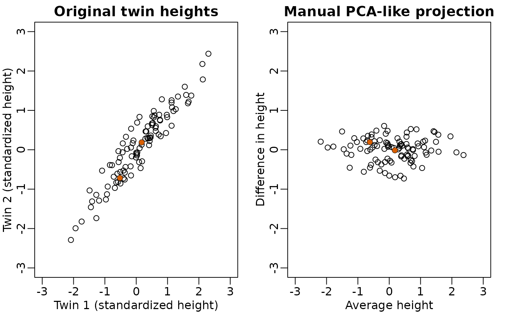

## Not much distance is lost in the second dimension

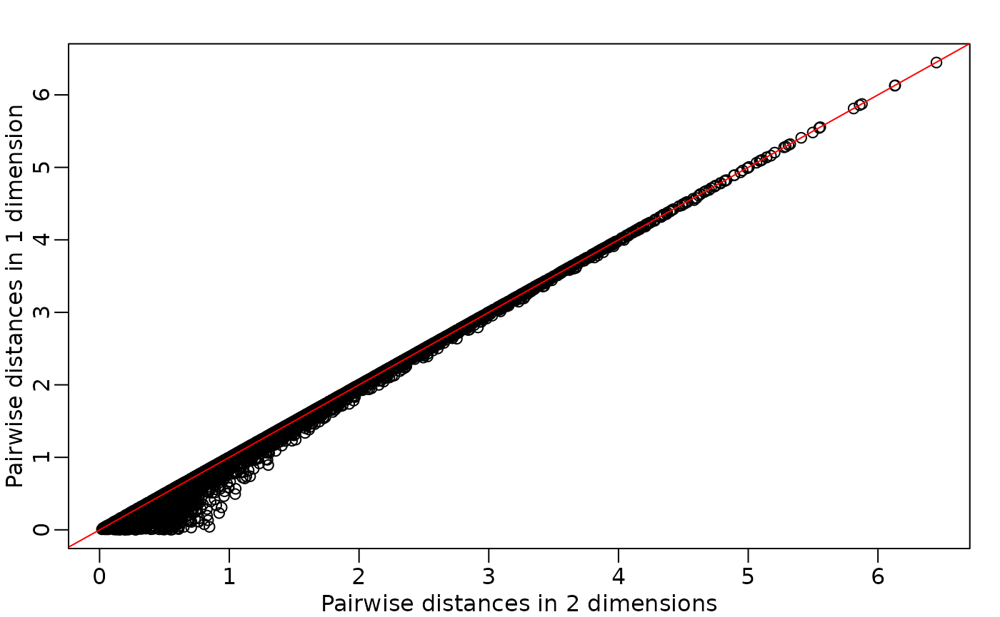

- Not much loss of height differences when just using average heights of
  twin pairs.
  - because twin heights are highly correlated

## Singular Value Decomposition (SVD)

SVD generalizes the example rotation we looked at:

``` math
\mathbf{Y} = \mathbf{UDV}^\top
```

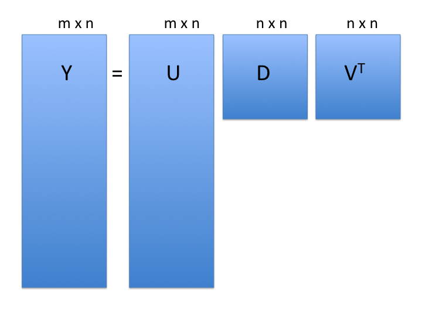

- **note**: the above formulation is for $`m`$ rows $`> n`$ columns

- $`\mathbf{Y}`$: the $`m`$ rows x $`n`$ cols matrix of measurements

- $`\mathbf{U}`$: $`m \times n`$ matrix relating original scores to PCA
  scores (**loadings**)

- $`\mathbf{D}`$: $`n \times n`$ diagonal matrix (**eigenvalues**)

- $`\mathbf{V}`$: $`n \times n`$*orthogonal* matrix (**eigenvectors or
  PCA scores**)

  - orthogonal = unit length and “perpendicular” in 3-D

## SVD of gene expression dataset

Center but do not scale, just to make plots before more legible:

``` r

e.standardize <- t(scale(t(e), scale = FALSE))
```

SVD:

``` r

s <- svd(e.standardize)
names(s)
#> [1] "d" "u" "v"
```

## Components of SVD results

``` r

dim(s$u) # loadings
#> [1] 22215   189
length(s$d) # eigenvalues
#> [1] 189
dim(s$v) # d %*% vT = scores
#> [1] 189 189
```


## PCA is a SVD

- gene expression dataset

``` r

rafalib::mypar()
p <- prcomp(t(e.standardize))
plot(s$u[, 1] ~ p$rotation[, 1])
```


**Lesson:** u and v can each be multiplied by -1 arbitrarily

## PCA interpretation: loadings


- $`\mathbf{U}`$ (**loadings**): relate the *principal component* axes
  to the original variables
  - think of principal component axes as a weighted combination of
    original axes

## Visualizing PCA loadings

``` r

df_loadings <- data.frame(Index = seq_len(nrow(p$rotation)), Loading = p$rotation[, 1])
ggplot(df_loadings, aes(x = Index, y = Loading)) +
  geom_point(alpha = 0.5, size = 1) +
  geom_hline(yintercept = c(-0.03, 0.03), color = "red", linetype = "dashed") +
  labs(title = "PC1 loadings of each gene", x = "Index of genes", y = "Loadings of PC1") +
  theme_minimal()
```

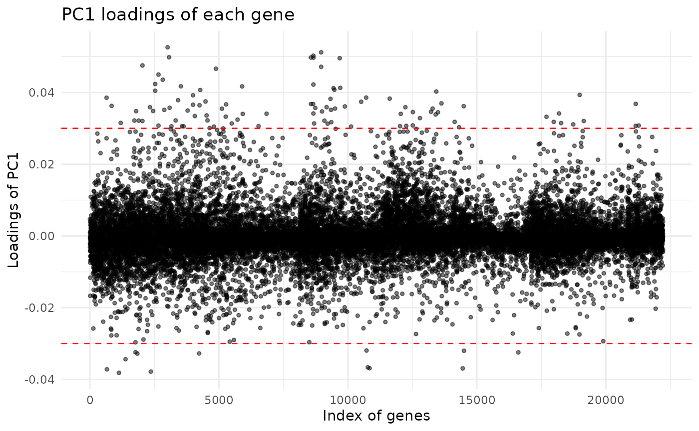

## Genes with high PC1 loadings

``` r

e.pc1genes <-
  e.standardize[p$rotation[, 1] < -0.03 |
    p$rotation[, 1] > 0.03, ]
pheatmap::pheatmap(
  e.pc1genes,
  scale = "none",
  show_rownames = TRUE,
  show_colnames = FALSE
)
```

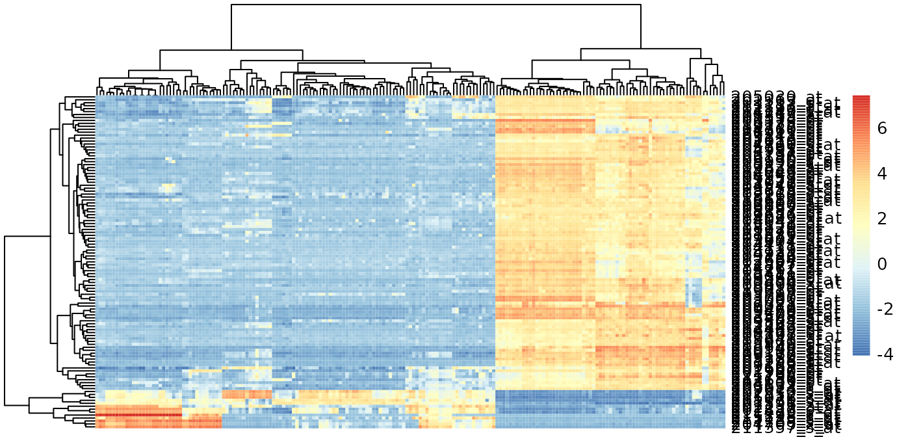

## PCA interpretation: eigenvalues

- $`\mathbf{D}`$ (**eigenvalues**): standard deviation scaling factor
  that each decomposed variable is multiplied by.

``` r

df_scree <- data.frame(
  PC = seq_along(p$sdev),
  Variance = p$sdev^2 / sum(p$sdev^2) * 100,
  Cumulative = cumsum(p$sdev^2) / sum(p$sdev^2) * 100
)

ggplot(df_scree[1:150, ], aes(x = PC, y = Variance)) +
  geom_line() +
  geom_point(size = 1) +
  labs(title = "Screeplot", y = "% variance explained") +
  theme_minimal()
```

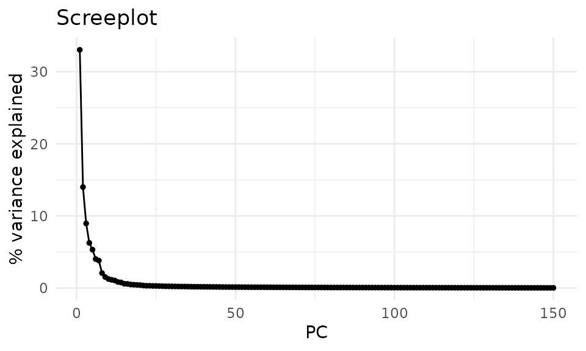

## PCA interpretation: eigenvalues

Alternatively as cumulative % variance explained (using
[`cumsum()`](https://rdrr.io/r/base/cumsum.html) function)

``` r

ggplot(df_scree, aes(x = PC, y = Cumulative)) +
  geom_line() +
  labs(title = "Cumulative screeplot", y = "Cumulative % variance explained") +
  coord_cartesian(ylim = c(0, 100)) +
  theme_minimal()
```

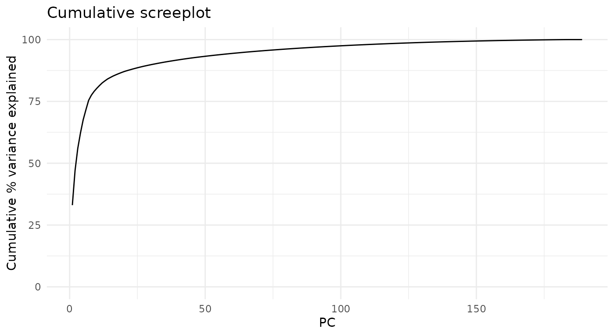

## PCA interpretation: scores


- $`\mathbf{V}`$ (**scores**): The “datapoints” in the reduced prinipal
  component space
- In some implementations (like
  [`prcomp()`](https://rdrr.io/r/stats/prcomp.html)), scores are already
  scaled by eigenvalues: $`\mathbf{D V^T}`$

## PCA interpretation: scores

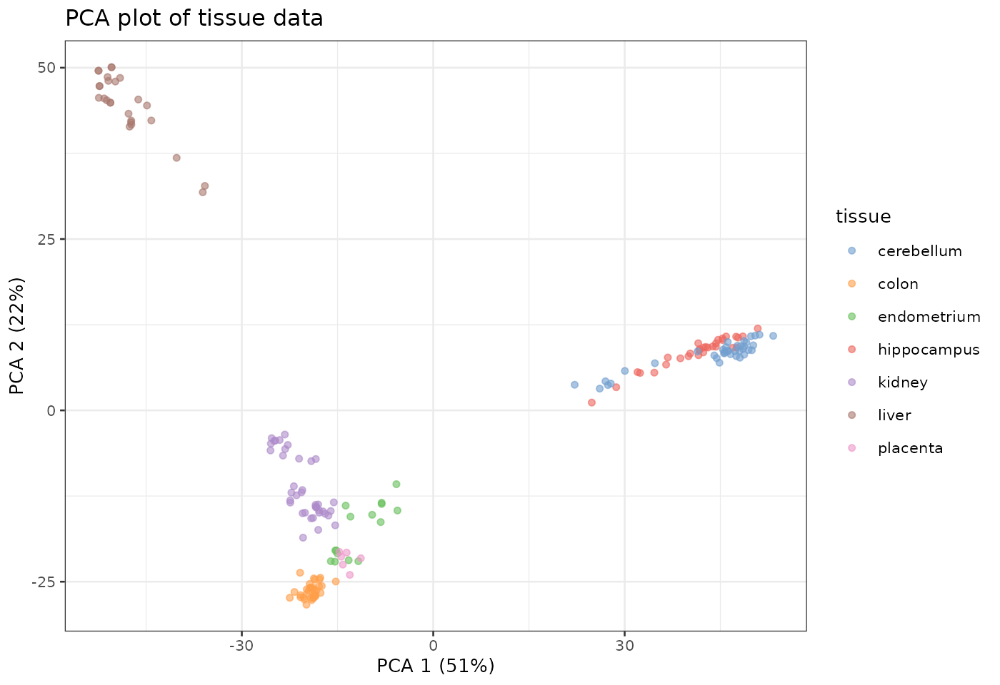

## Multi-dimensional Scaling (MDS)

- also referred to as Principal Coordinates Analysis (PCoA)
- a reduced SVD, performed on a distance matrix
- identify two (or more) eigenvalues/vectors that preserve distances

``` r

d <- as.dist(1 - cor(e.standardize))
mds <- cmdscale(d)
```

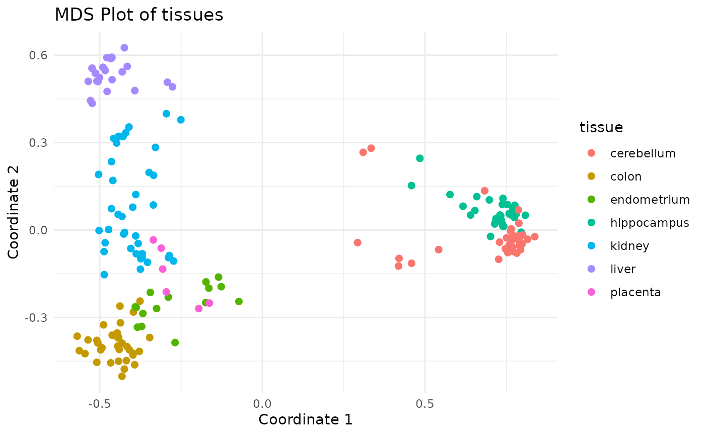

## t-SNE

- non-linear dimension reduction method very popular for visualizing
  single-cell data
  - almost magical ability to show clearly separated clusters
  - performs different transformations on different regions
- computationally intensive so usually done only on top ~30 PCs
- t-SNE is sensitive to choices of tuning parameters
  - “perplexity” parameter defines (loosely) how to balance attention
    between local and global aspects of data
  - optimal choice of perplexity changes for different numbers of cells
    from the **same** sample.
  - perplexity = $`\sqrt{N}`$ is one rule of thumb. $`max(N/5, 50)`$ is
    another (default of
    [Rtsne](https://cran.r-project.org/package=Rtsne))
  - Here is a [good post by Nikolay
    Oskolkov](https://towardsdatascience.com/how-to-tune-hyperparameters-of-tsne-7c0596a18868)
    on this topic.

## t-SNE caveats

- uses a random number generator
- apparent spread of clusters is completely meaningless
- distance between clusters might also not mean anything
- parameters can be tuned to make data appear how you want
- can show apparent clusters in random noise. Should *not* be used for
  statistical inference
- Try it to gain some intuition:
  <https://distill.pub/2016/misread-tsne/>)

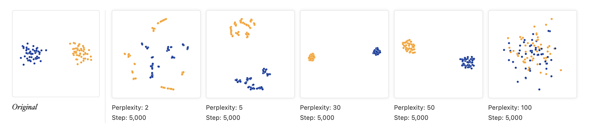

tSNE

## PCA of Zeisel single-cell RNA-seq dataset

``` r

sce.zeisel <- fixedPCA(sce.zeisel, subset.row = NULL)
#> Warning in fixedPCA(sce.zeisel, subset.row = NULL): 'fixedPCA' is deprecated.
#> Use 'scrapper::runPca.se' instead.
#> See help("Deprecated")
plotReducedDim(sce.zeisel, dimred = "PCA", colour_by = "level1class")
```


Principal Components Analysis of Zeisel dataset

## t-SNE of the same dataset

``` r

sce.zeisel <- runTSNE(sce.zeisel, dimred = "PCA")
plotReducedDim(sce.zeisel, dimred = "TSNE", colour_by = "level1class")
```


t-SNE clustering of Zeisel dataset

## UMAP vs t-SNE

- UMAP may better preserve local and global distances
- tends to have more compact visual clusters with more empty space
  between them
- more computationally efficient
- also involves random number generation
- Note: I prefer *not* setting the random number seed during exploratory
  analysis in order to see the random variability

## UMAP of the same dataset

``` r

sce.zeisel <- runUMAP(sce.zeisel, dimred = "PCA")
plotReducedDim(sce.zeisel, dimred = "UMAP", colour_by = "level1class")
```


UMAP representation of the Zeisel dataset

## tSNE of tissue microarray data

Using default parameters and no log transformation

``` r

# We already set up `sce` with `tissue` earlier
sce <- runTSNE(sce, dimred = "PCA")
plotReducedDim(sce, dimred = "TSNE", colour_by = "tissue")
```

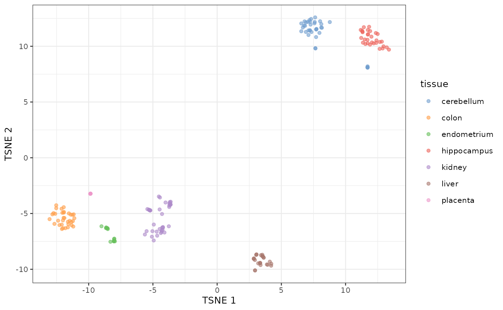

## UMAP of tissue microarray data

Also using default parameters and no log transformation

``` r

sce <- runUMAP(sce, dimred = "PCA")
plotReducedDim(sce, dimred = "UMAP", colour_by = "tissue")
```

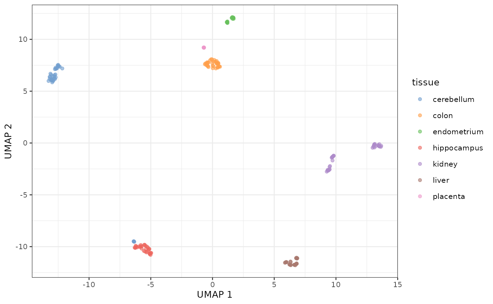

## Summary: distances and dimension reduction

- **Note**: signs of rotations (loadings) and eigenvectors (scores) can
  be arbitrarily flipped
- PCA and MDS are useful for dimension reduction when you have
  **correlated variables**
- Variables are always centered.  
- Variables are also scaled unless you know they have the same scale in
  the population
- PCA projection can be applied to new datasets if you know the matrix
  calculations
- PCA is subject to over-fitting, screeplot can be tested by
  cross-validation
- PCA is often used prior to t-SNE and UMAP for de-noising and
  computational tractability

## Lab exercise

- **Check your BLAS**: Matrix multiplication speed relies heavily on
  your Basic Linear Algebra Subprograms (BLAS). In the lab, verify you
  are using an optimized BLAS (like OpenBLAS, Intel MKL, or Apple
  Accelerate). You can check this by running
  [`sessionInfo()`](https://rdrr.io/r/utils/sessionInfo.html) in your R
  console and looking for the “Matrix products:” and “BLAS:” fields. If
  it points to `libRblas.so` or `libR.dylib` (instead of
  e.g. `libopenblas.so` or `vecLib`), you might be using the unoptimized
  default!
- OSCA Basics: [Chapter 4 Dimensionality
  Reduction](http://bioconductor.org/books/release/OSCA.basic/dimensionality-reduction.md)
- Optional if you are interested, OSCA Advanced: [Chapter 4
  Dimensionality reduction,
  redux](http://bioconductor.org/books/release/OSCA.advanced/dimensionality-reduction-redux.md)

## Links

- A built
  [html](https://waldronlab.io/AppStatBio/articles/day2_unsupervised.html)
  version of this lecture is available.
- The
  [source](https://github.com/waldronlab/AppStatBio/blob/main/vignettes/day2_unsupervised.Rmd)
  R Markdown is also available from Github.
