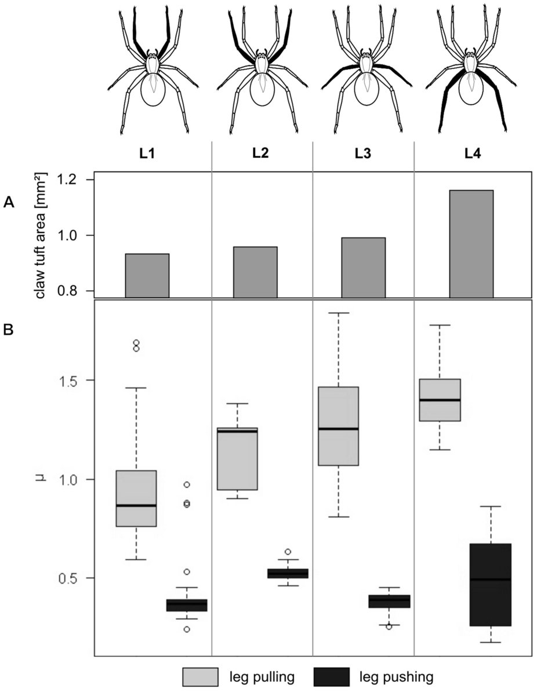
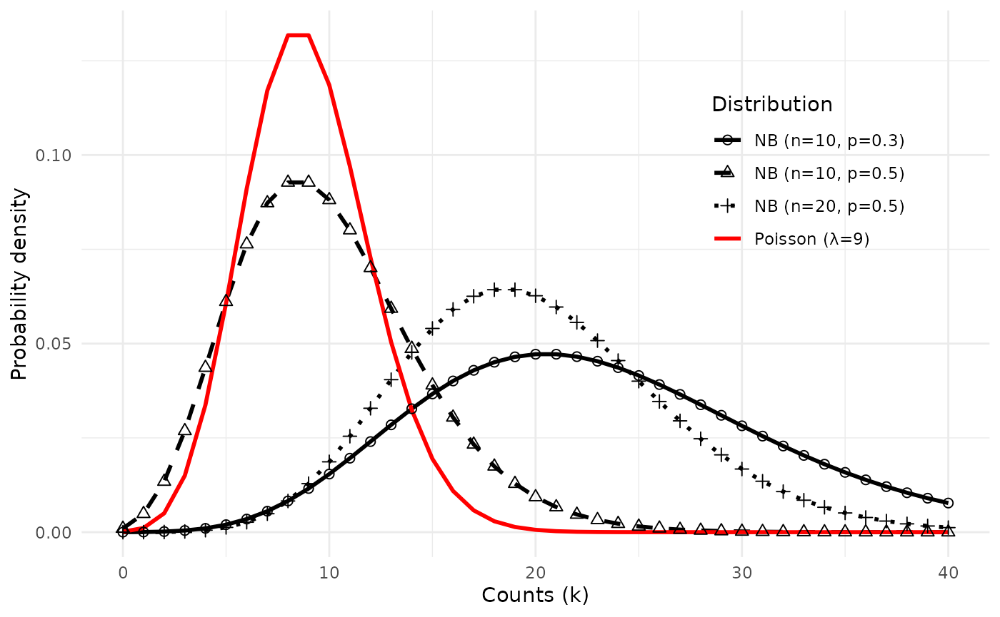

# Applied Statistics for High-throughput Biology: Session 3

## Outline

- Multiple linear regression
  - Continuous and categorical predictors
  - Interactions
- Model formulae
- Generalized Linear Models
  - Linear, logistic, log-Linear links
  - Poisson, Negative Binomial error distributions
- Multiple Hypothesis Testing

## Textbook sources

- [Biomedical Data Science](http://genomicsclass.github.io/book/)
  - Chapter 5: Linear models
  - Chapter 6: Inference for high-dimensional data
- [Modern Statistics for Modern
  Biology](https://www.huber.embl.de/msmb/06-chap.html)
  - Chapter 6: Testing
- [OSCA
  multi-sample](http://bioconductor.org/books/release/OSCA.multisample/)
  - Chapter 4: [DE analyses between
    conditions](http://bioconductor.org/books/release/OSCA.multisample/multi-sample-comparisons.md)

## Example: friction of spider legs



- **(A)** Barplot showing total claw tuft area of the corresponding
  legs.
- **(B)** Boxplot presenting friction coefficient data illustrating
  median, interquartile range and extreme values.

- Wolff & Gorb, [Radial arrangement of Janus-like setae permits friction
  control in spiders](http://www.nature.com/articles/srep01101), *Sci.
  Rep.*
  2013. 

## Questions


- Are the pulling and pushing friction coefficients different?
- Are the friction coefficients different for the different leg pairs?
- Does the difference between pulling and pushing friction coefficients
  vary by leg pair?

## Exploratory Data Analysis

``` r

table(spider$leg,spider$type)
#>     
#>      pull push
#>   L1   34   34
#>   L2   15   15
#>   L3   52   52
#>   L4   40   40
summary(spider)
#>         leg             type        friction     
#>  Length   :282   Length   :282   Min.   :0.1700  
#>  N.unique :  4   N.unique :  2   1st Qu.:0.3900  
#>  N.blank  :  0   N.blank  :  0   Median :0.7600  
#>  Min.nchar:  2   Min.nchar:  4   Mean   :0.8217  
#>  Max.nchar:  2   Max.nchar:  4   3rd Qu.:1.2400  
#>                                  Max.   :1.8400
```

## Re-create the boxplot


Boxplot of friction coefficients by leg type and leg pair

Notes:

- Pulling friction is higher
- Pulling (but not pushing) friction increases for further back legs (L1
  -\> 4)
- Variance isn’t constant

## What are linear models?

The following are examples of linear models:

1.  $`Y_i = \beta_0 + \beta_1 x_i + \varepsilon_i`$ (simple linear
    regression)
2.  $`Y_i = \beta_0 + \beta_1 x_i + \beta_2 x_i^2 + \varepsilon_i`$
    (quadratic regression)
3.  $`Y_i = \beta_0 + \beta_1 x_i + \beta_2 \times 2^{x_i} + \varepsilon_i`$
    ($`2^{x_i}`$ is a new transformed variable)

## Multiple linear regression model

- Linear models can have any number of predictors
- Systematic part of model:

``` math
E[y|x] = \beta_0 + \beta_1 x_1 + \beta_2 x_2 + ... + \beta_p x_p
```

- $`E[y|x]`$ is the expected value of $`y`$ given $`x`$
- $`y`$ is the outcome, response, or dependent variable
- $`x`$ is the vector of predictors / independent variables
- $`x_p`$ are the individual predictors or independent variables
- $`\beta_p`$ are the regression coefficients

Random part of model:

$`y_i = E[y_i|x_i] + \epsilon_i`$

Assumptions of the linear regression model:
$`\epsilon_i \stackrel{iid}{\sim} N(0, \sigma_\epsilon^2)`$

- Normal distribution
- Mean zero at every value of predictors
- Constant variance at every value of predictors
- Values that are statistically independent

## Continuous predictors

- **Coding:** as-is, or may be scaled to unit variance (which results in
  *adjusted* regression coefficients)
- **Interpretation for linear regression:** An increase of one unit of
  the predictor results in this much difference in the continuous
  outcome variable

## Binary predictors (2 levels)

- **Coding:** indicator or dummy variable (0-1 coding)
- **Interpretation for linear regression:** the increase or decrease in
  average outcome levels in the group coded “1”, compared to the
  reference category (“0”)
  - *e.g.* $`E(y|x) = \beta_0 + \beta_1 x`$
  - where x={ 1 if push friction, 0 if pull friction }

## Multilevel categorical predictors (ordinal or nominal)

- **Coding:** $`K-1`$ dummy variables for $`K`$-level categorical
  variable
- Comparisons with respect to a reference category, *e.g.* `L1`:
  - `L2`={1 if $`2^{nd}`$ leg pair, 0 otherwise},
  - `L3`={1 if $`3^{nd}`$ leg pair, 0 otherwise},
  - `L4`={1 if $`4^{th}`$ leg pair, 0 otherwise}.
- R re-codes factors to dummy variables automatically.
- Dummy coding depends on the reference level

## Model formulae in R

[Model formulae
tutorial](http://ww2.coastal.edu/kingw/statistics/R-tutorials/formulae.md)

- regression functions in R such as
  [`aov()`](https://rdrr.io/r/stats/aov.html),
  [`lm()`](https://rdrr.io/r/stats/lm.html),
  [`glm()`](https://rdrr.io/r/stats/glm.html), and `coxph()` use a
  “model formula” interface.
- The formula determines the model that will be built (and tested) by
  the R procedure. The basic format is:

`> response variable ~ explanatory variables`

- The tilde means “is modeled by” or “is modeled as a function of.”

## Regression with a single predictor

Model formula for simple linear regression:

`> y ~ x`

- where “x” is the explanatory (independent) variable
- “y” is the response (dependent) variable.

## Return to the spider legs

Friction coefficient for leg type of first leg pair:

``` r

spider.sub <- dplyr::filter(spider, leg=="L1")
fit <- lm(friction ~ type, data=spider.sub)
summary(fit)
#> 
#> Call:
#> lm(formula = friction ~ type, data = spider.sub)
#> 
#> Residuals:
#>      Min       1Q   Median       3Q      Max 
#> -0.33147 -0.10735 -0.04941 -0.00147  0.76853 
#> 
#> Coefficients:
#>             Estimate Std. Error t value Pr(>|t|)    
#> (Intercept)  0.92147    0.03827  24.078  < 2e-16 ***
#> typepush    -0.51412    0.05412  -9.499  5.7e-14 ***
#> ---
#> Signif. codes:  0 '***' 0.001 '**' 0.01 '*' 0.05 '.' 0.1 ' ' 1
#> 
#> Residual standard error: 0.2232 on 66 degrees of freedom
#> Multiple R-squared:  0.5776, Adjusted R-squared:  0.5711 
#> F-statistic: 90.23 on 1 and 66 DF,  p-value: 5.698e-14
```

## Regression on spider leg type

Regression coefficients for `friction ~ type` for first set of spider
legs:

``` r

broom::tidy(fit)
#> # A tibble: 2 × 5
#>   term        estimate std.error statistic  p.value
#>   <chr>          <dbl>     <dbl>     <dbl>    <dbl>
#> 1 (Intercept)    0.921    0.0383     24.1  2.12e-34
#> 2 typepush      -0.514    0.0541     -9.50 5.70e-14
```

- How to interpret this table?
  - Coefficients for **(Intercept)** and **typepush**
  - Coefficients are t-distributed when assumptions are correct
  - Standard deviation in the estimates of each coefficient can be
    calculated (standard errors)

## Interpretation of spider leg type coefficients


Diagram of the estimated coefficients in the linear model. The green
dashed line indicates the Intercept term (mean of the reference group
‘pull’). The orange dashed line indicates the push group mean. The solid
green/orange segments explicitly show the intercept distance and the
effect difference.

## regression on spider leg **position**

Remember there are positions 1-4

``` r

fit <- lm(friction ~ leg, data=spider)
```

``` r

knitr::kable(broom::tidy(fit), digits = 3)
```

| term        | estimate | std.error | statistic | p.value |
|:------------|---------:|----------:|----------:|--------:|
| (Intercept) |    0.664 |     0.054 |    12.338 |   0.000 |
| legL2       |    0.172 |     0.097 |     1.766 |   0.078 |
| legL3       |    0.160 |     0.069 |     2.318 |   0.021 |
| legL4       |    0.281 |     0.073 |     3.841 |   0.000 |

- Interpretation of the dummy variables legL2, legL3, legL4 ?

## Aside: beautiful regression tables using gt

``` r

library(gtsummary)
library(gt)
regression_table <- tbl_regression(fit) |>
  as_gt() |> # Convert to a gt object for more control
  gt::tab_header(
    title = "Linear Regression Model Summary",
    subtitle = "Analysis of friction based on spider leg type and pair."
  )
print(regression_table)
```

[TABLE]

## Regression with multiple predictors

Additional explanatory variables can be added as follows:

`> y ~ x + z`

Note that “+” does not have its usual meaning, which would be achieved
by:

`> y ~ I(x + z)`

## Regression on spider leg **type** and **position**

``` r

fit <- lm(friction ~ type + leg, data=spider)
```

``` r

gtsummary::tbl_regression(fit)
```

[TABLE]

- this model still doesn’t represent how the friction differences
  between different leg positions are modified by whether it is pulling
  or pushing

## Interaction (effect modification)

Interaction is modeled as the product of two covariates:
``` math
E[y|x] = \beta_0 + \beta_1 x_1 + \beta_2 x_2 + \beta_{12} x_1*x_2
```


Interaction between coffee and time of day on performance

Image credit: <http://personal.stevens.edu/~ysakamot/>

## Interaction in the spider leg model

``` r

fit <- lm(friction ~ type * leg, data=spider)
```

``` r

gtsummary::tbl_regression(fit)
```

[TABLE]

## Model formulae (cont’d)

| symbol | example | meaning |
|----|----|----|
| \+ | \+ x | include this variable |
| \- | \- x | delete this variable |
| : | x : z | include the interaction |
| \* | x \* z | include these variables and their interactions |
| ^ | (u + v + w)^3 | include these variables and all interactions up to three way |
| 1 | -1 | intercept: delete the intercept |

Note: order generally doesn’t matter (u+v OR v+u)

## Summary: types of standard linear models

    lm( y ~ u + v)

`u` and `v` factors: **ANOVA**  
`u` and `v` numeric: **multiple regression**  
one factor, one numeric: **ANCOVA**

- R does a lot for you based on your variable classes
  - be **sure** you know the classes of your variables
  - be sure all rows of your regression output make sense

## Generalized Linear Models

- Linear regression is a special case of a broad family of models called
  “Generalized Linear Models” (GLM)
- This unifying approach allows to fit a large set of models using
  maximum likelihood estimation methods (MLE) (Nelder & Wedderburn,
  1972)
- Can model many types of data directly using appropriate distributions,
  e.g. Poisson distribution for count data
- Transformations of $`y`$ not needed

## Components of a GLM

``` math
g\left( E[y|x] \right) = \beta_0 + \beta_1 x_{1i} + \beta_2 x_{2i} + ... + \beta_p x_{pi}
```

- **Random component** specifies the conditional distribution for the
  response variable
  - doesn’t have to be normal
  - can be any distribution in the “exponential” family of distributions
- **Systematic component** specifies linear function of predictors
  (linear predictor)
- **Link** \[denoted by $`g(.)`$\] specifies the relationship between
  the expected value of the random component and the systematic
  component
  - can be linear or nonlinear

## Linear Regression as GLM

- Useful for log-transformed microarray data

- **The model**:
  $`y_i = E[y|x] + \epsilon_i = \beta_0 + \beta_1 x_{1i} + \beta_2 x_{2i} + ... + \beta_p x_{pi} + \epsilon_i`$

- **Random component** of $`y_i`$ is normally distributed:
  $`\epsilon_i \stackrel{iid}{\sim} N(0, \sigma_\epsilon^2)`$

- **Systematic component** (linear predictor):
  $`\beta_0 + \beta_1 x_{1i} + \beta_2 x_{2i} + ... + \beta_p x_{pi}`$

- **Link function** here is the *identity link*:
  $`g(E(y | x)) = E(y | x)`$. We are modeling the mean directly, no
  transformation.

## Logistic Regression as GLM

- Useful for binary outcomes, e.g. Single Nucleotide Polymorphisms or
  somatic variants

- **The model**:
  ``` math
  Logit(P(x)) = log \left( \frac{P(x)}{1-P(x)} \right) = \beta_0 + \beta_1 x_{1i} + \beta_2 x_{2i} + ... + \beta_p x_{pi}
  ```

- **Random component**: $`y_i`$ follows a Binomial distribution (outcome
  is a binary variable)

- **Systematic component**: linear predictor
  ``` math
  \beta_0 + \beta_1 x_{1i} + \beta_2 x_{2i} + ... + \beta_p x_{pi}
  ```

- **Link function**: *logit* (log of the odds that the event occurs)

``` math
g(P(x)) = logit(P(x)) = log\left( \frac{P(x)}{1-P(x)} \right)
```

``` math
P(x) = g^{-1}\left( \beta_0 + \beta_1 x_{1i} + \beta_2 x_{2i} + ... + \beta_p x_{pi}
 \right)
```

## Log-linear GLM

The systematic part of the GLM is:

``` math
log\left( E[y|x] \right) = \beta_0 + \beta_1 x_{1i} + \beta_2 x_{2i} + ... + \beta_p x_{pi} + log(t_i)
```

- Common for count data
  - can account for differences in sequencing depth by an *offset*
    $`log(t_i)`$
  - guarantees non-negative expected number of counts
  - often used in conjunction with **Poisson** or **Negative Binomial**
    error models

## Poisson error model

``` math
f(k, \lambda) = e^{-\lambda} \frac{\lambda^k}{k!}
```

- where $`f`$ is the probability of $`k`$ events (e.g. # of reads
  counted), and
- $`\lambda`$ is the mean number of events, so $`E[y|x]`$
- $`\lambda`$ is also the variance of the number of events

## Negative Binomial error model

- *aka* gamma–Poisson mixture distribution

``` math
f(k, \lambda, \theta) = \frac{\Gamma(\frac{1 + \theta k}{\theta})}{k! \, \Gamma(\frac{1}{\theta})} 
    \left(\frac{\theta m}{1+\theta m}\right)^k 
    \left(1+\theta m\right)^\theta
    \quad\text{for }k = 0, 1, 2, \dotsc
```

- where $`f`$ is still the probability of $`k`$ events (e.g. # of reads
  counted),
- $`\lambda`$ is still the mean number of events, so $`E[y|x]`$
- An additional **dispersion parameter** $`\theta`$ is estimated:
  - $`\theta \rightarrow 0`$: Poisson distribution
  - $`\theta \rightarrow \infty`$: Gamma distribution
- The Poisson model can be considered as **nested** within the Negative
  Binomial model
- A likelihood ratio test comparing the two models is possible

## Compare Poisson vs. Negative Binomial

- The Negative Binomial Distribution
  ([`dbinom()`](https://rdrr.io/r/stats/Binomial.html)) has two
  parameters:
  1.  \# of trials n,
  2.  probability of success p



## Additive vs. multiplicative models

- Linear regression is an *additive* model
  - *e.g.* for two binary variables $`\beta_1 = 1.5`$,
    $`\beta_2 = 1.5`$.
  - If $`x_1=1`$ and $`x_2=1`$, this adds 3.0 to $`E(y|x)`$
- Logistic and log-linear models are *multiplicative*:
  - If $`x_1=1`$ and $`x_2=1`$, this adds 3.0 to $`log(\frac{P}{1-P})`$
  - Odds-ratio $`\frac{P}{1-P}`$ increases 20-fold: $`exp(1.5+1.5)`$ or
    $`exp(1.5) * exp(1.5)`$

## Inference in high dimensions (many variables)

- Conceptually similar to what we have already done
  - $`Y_i`$ expression of a gene, etc
- Just repeated many times, e.g.:
  - is the mean expression of a gene different between two groups
    (t-test)
  - is the mean expression of a gene different between any of several
    groups (1-way ANOVA)
  - do this simple analysis thousands of times
  - *note*: for small sample sizes, some Bayesian improvements can be
    made (i.e. limma, edgeR, DESeq2)
- It is in prediction and machine learning where $`Y`$ is a label like
  patient outcome, and we can have high-dimensional predictors

## Multiple testing

- When testing thousands of true null hypotheses with $`\alpha = 0.05`$,
  you expect a 5% type I error rate
- What p-values are even smaller than you expect by chance from multiple
  testing?
- Two mainstream approaches for controlling type I error rate:

1.  Family-wise error rate (*e.g.*, Bonferroni correction).
    - Controlling FWER at 0.05 ensures that the probably of *any* type I
      errors is \< 0.05.
2.  False Discovery Rate (*e.g.*, Benjamini-Hochberg correction)
    - Controlling FDR at 0.05 ensures that fraction of type I errors is
      \< 0.05.
    - see [MSMB Chapter 6 -
      testing](https://www.huber.embl.de/msmb/06-chap.html)

## Benjamini-Hochberg FDR algorithm

Source: [MSMB Chapter
6](https://www.huber.embl.de/msmb/06-chap.html#the-benjamini-hochberg-algorithm-for-controlling-the-fdr)

1.  order the p-values from $`m`$ hypothesis tests in increasing order,
    $`p_1, \ldots, p_m`$
2.  for some choice of $`\phi`$ (our target FDR), find the largest value
    of that $`k`$ that satisfies: $`p_k \leq \phi k/m`$
3.  reject the hypotheses $`1, \ldots, k`$


Benjamini-Hochberg FDR, visually

Important notes for intuition:

- You can have FDR \< 0.05 with thousands of tests even if your smallest
  p-value is 0.01 or 0.001 (ie from permutation tests)
- FDR is a property of groups of tests, not of individual tests
- rank of FDR values can be different than rank of p-values

## FDR alternatives to Benjamini-Hochberg

- [“Local” False Discovery
  Rate](https://www.huber.embl.de/msmb/06-chap.html#sec-testing-localfdr)
  or *q-value*
  - The *q-value* of a test estimates the proportion of false positives
    incurred when *that particular test and all smaller p-values* are
    called significant (packages:
    [qvalue](https://bioconductor.org/packages/qvalue/) or
    [fdrtool](https://cran.r-project.org/web/packages/fdrtool/))
  - q-value increases monotonically with p-value (unlike
    Benjamini-Hochberg FDR)
- [Independent Hypothesis
  Weighting](https://www.huber.embl.de/msmb/06-chap.html#independent-hypothesis-weighting)
  - can improve power by modeling the relationship between a covariate
    property (such as mean expression) and probability of rejecting
    $`H_0`$
  - works best with lots of tests (ie, thousands)
  - implemented in the [IHW](https://bioconductor.org/packages/IHW/)
    Bioconductor package and in
    [DESeq2](https://bioconductor.org/packages/DESeq2/)

## Beware of “double-dipping” in statistical inference

1.  define a separation between observations
2.  test for a difference across the separation


Example from: García-Mantrana *et al.*, Gut Microbes 2020

- For a full treatment see <https://arxiv.org/abs/2012.02936> and
  <https://pubmed.ncbi.nlm.nih.gov/31521605>
- Or a nice lecture: Daniela Whitten “Double-dipping” in statistics:
  <https://youtu.be/tiv--XjPl9M>

## Simple example of double-dipping

*Step 1*: define an age classifier

- Elderly \>70 yrs
- Youth \<18 years
- Otherwise unclassified

*Step 2*: test for a difference in ages between elderly and youth

**IMPORTANT**: Even applying a fully-specified classifier to a
validation dataset does not protect against inflated p-values from
“double-dipping”

## Summary

- Linear models are the basis for identifying differential expression /
  differential abundance

- **Generalized Linear Models** extend linear regression to:

  - binary $`y`$ (logistic regression)
  - count $`y`$ (log-linear regression with e.g. Poisson or Negative
    Binomial link functions)

- FWER, FDR, local FDR (q-value), Independent Hypothesis Testing

- Be aware of “double-dipping” in statistical inference

## Exercises

- Repeat analyses of OSCA multi-sample Chapter 4: [DE analyses between
  conditions](http://bioconductor.org/books/3.17/OSCA.multisample/multi-sample-comparisons.md)

Please discuss the following questions:

1.  What is a major problem with the hypothesis testing in [4.6 Testing
    for between-label
    differences](http://bioconductor.org/books/3.17/OSCA.multisample/multi-sample-comparisons.html#testing-for-between-label-differences)?
    - (note, the inference problem is acknowledged in this section)
2.  What is a related problem with the hypothesis testing in [4.4
    Performing the DE
    analysis](http://bioconductor.org/books/3.17/OSCA.multisample/multi-sample-comparisons.html#performing-the-de-analysis)?
3.  How might you avoid these same problems, with the same data or a
    multi’omic technology?

## Links

- A built
  [html](https://waldronlab.io/AppStatBio/articles/day3_linearmodels.html)
  version of this lecture is available.
- The
  [source](https://github.com/waldronlab/AppStatBio/blob/main/vignettes/day3_linearmodels.Rmd)
  R Markdown is available from Github.
