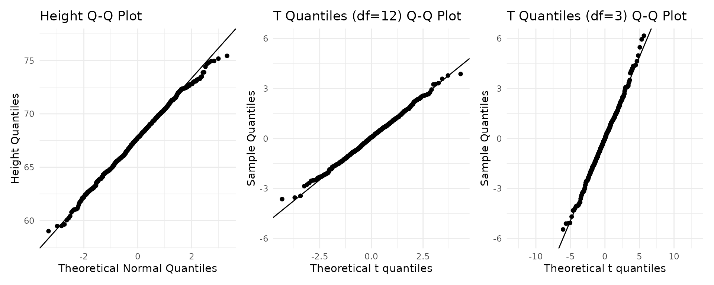
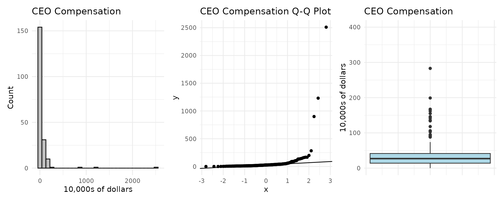
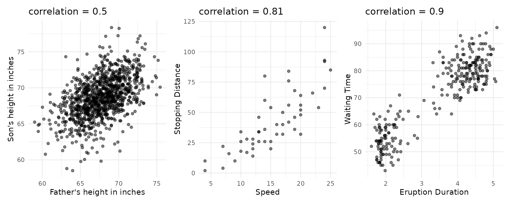
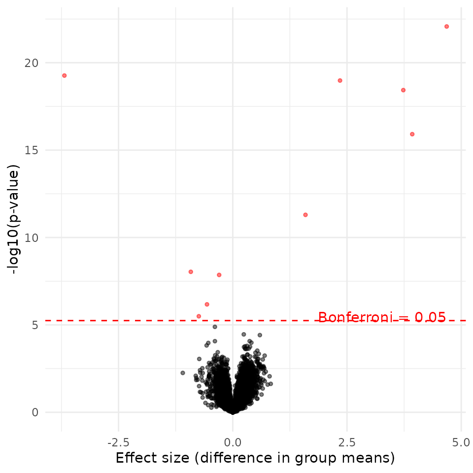
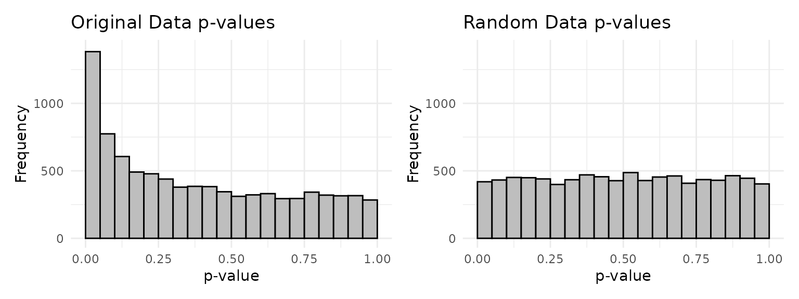
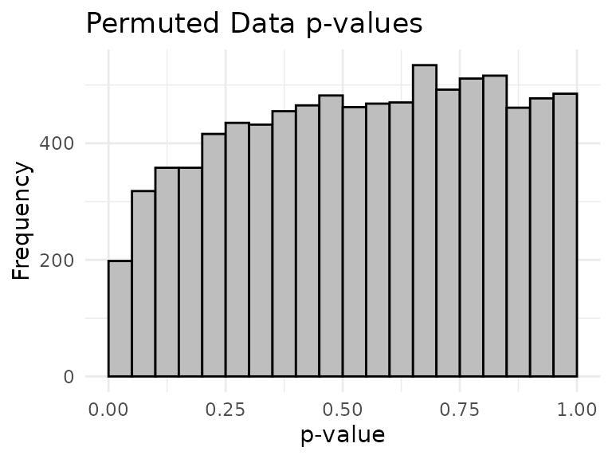
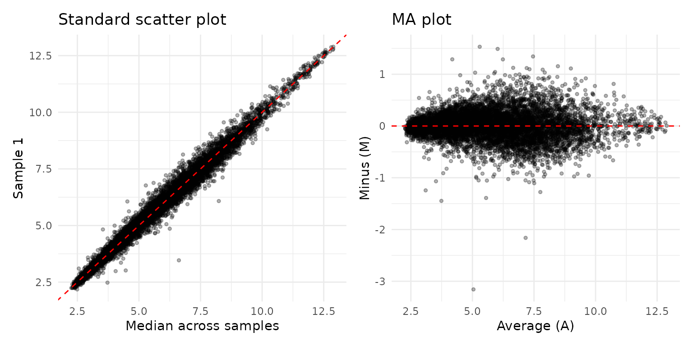
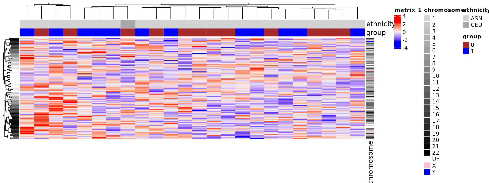

# Applied Statistics for High-throughput Biology: Session 4

### Outline

- [Exploratory data
  analysis](https://genomicsclass.github.io/book/pages/exploratory_data_analysis.html)
  (Chapter 2)
  - Quantile Quantile (QQ)-plots
  - Boxplots
  - Scatterplots
  - Volcano plots
  - p-value histograms
  - MA plots
  - heatmaps
- [Batch
  effects](http://genomicsclass.github.io/book/pages/intro_to_batch_effects.md)
  (Chapter 10)

## Exploratory data analysis

### Introduction

> “The greatest value of a picture is when it forces us to notice what
> we never expected to see.” - John W. Tukey

- Discover biases, systematic errors and unexpected variability in data.
- Graphical approach to detecting these issues. Represents a first step
  in data analysis and guides hypothesis testing.
- EDA helps us check the assumptions of our statistical tests.
- Opportunities for discovery are often in the outliers.

### Quantile Quantile Plots

- **Why use them?** A primary tool for checking if our data follows a
  theoretical distribution.\`
- Quantiles divide a distribution into equally sized bins (e.g., 100
  bins for percentiles).
- We plot the quantiles from our data against the theoretical quantiles
  of a distribution (e.g., the normal distribution).
- If our data perfectly matches the theoretical distribution, the points
  will form a straight line ($`y=x`$). Deviations from the line indicate
  our data does not fit that distribution.

### Example: Quantile Quantile Plots



### Boxplots: About

- **Why use them?** Boxplots excel at showing the distribution of data,
  especially when it is not normally distributed (e.g., highly skewed
  data like income).
- They provide a simple, easy-to-interpret summary of the data’s range,
  center, and spread, while clearly highlighting outliers.
- Their greatest advantage comes from placing them side-by-side to
  compare distributions across multiple groups at once.

### Boxplots: Example



Three different views of a continuous variable. The boxplot clearly
shows the skew and outliers.

### Scatterplots And Correlation: About

- For two continuous variables, a scatter plot graphically shows the
  relationship, while correlation provides a single number to summarize
  its strength and direction.
- Quick and easy with
  [`plot()`](https://rdrr.io/r/graphics/plot.default.html) and
  [`cor()`](https://rdrr.io/r/stats/cor.html).

### Scatterplots And Correlation: Example



### Exploratory data analysis in high dimensions

``` r

library(GSE5859Subset)
data(GSE5859Subset) ##this loads three tables
class(geneExpression)
#> [1] "matrix" "array"
dim(geneExpression)
#> [1] 8793   24
class(sampleInfo)
#> [1] "data.frame"
dim(sampleInfo)
#> [1] 24  4
head(sampleInfo)
#>     ethnicity       date         filename group
#> 107       ASN 2005-06-23 GSM136508.CEL.gz     1
#> 122       ASN 2005-06-27 GSM136530.CEL.gz     1
#> 113       ASN 2005-06-27 GSM136517.CEL.gz     1
#> 163       ASN 2005-10-28 GSM136576.CEL.gz     1
#> 153       ASN 2005-10-07 GSM136566.CEL.gz     1
#> 161       ASN 2005-10-07 GSM136574.CEL.gz     1
```

### Volcano plots: Setup

T-test for every row (gene) of gene expression matrix:

``` r

library(genefilter)
g <- factor(sampleInfo$group)
system.time(results <- rowttests(geneExpression, g))
#>    user  system elapsed 
#>   0.005   0.000   0.005
pvals <- results$p.value
```

Note that these 8,793 tests are done in about 0.01s

### Volcano plots: Example

    #> 
    #> Attaching package: 'dplyr'
    #> The following objects are masked from 'package:Hmisc':
    #> 
    #>     src, summarize
    #> The following object is masked from 'package:MASS':
    #> 
    #>     select
    #> The following objects are masked from 'package:stats':
    #> 
    #>     filter, lag
    #> The following objects are masked from 'package:base':
    #> 
    #>     intersect, setdiff, setequal, union



### Volcano plots: Summary

- A volcano plot lets us visualize both the **statistical significance**
  (p-value) and **biological significance** (effect size or fold change)
  at the same time for thousands of genes.
- **Top-right/left corners:** Genes with large effect sizes and high
  statistical significance. These are often the most interesting
  candidates.
- **Top-center:** Genes that are statistically significant but have a
  small effect size.
- **Bottom:** Genes that are not statistically significant, regardless
  of their effect size.
- Can color points by significance threshold. Check for asymmetry, which
  might indicate biases.

### P-value histograms: Setup

- If all null hypotheses are true (i.e., no genes are truly
  differentially expressed), we expect a **flat histogram** of p-values,
  where every p-value from 0 to 1 is equally likely.

``` r

m <- nrow(geneExpression)
n <- ncol(geneExpression)
set.seed(1)
randomData <- matrix(rnorm(n * m), m, n)
nullpvals <- rowttests(randomData, g)$p.value
```

### P-value histograms: Example



### P-value histograms: Example 2 (permutation)

Note that permuting these data doesn’t produce an ideal null p-value
histogram due to batch effects:

``` r

permg <- sample(g)
permresults <- rowttests(geneExpression, permg)

ggplot(data.frame(pvalue = permresults$p.value), aes(x = pvalue)) +
  geom_histogram(breaks = seq(0, 1, 0.05), fill = "gray", color = "black") +
  labs(title = "Permuted Data p-values", x = "p-value", y = "Frequency") +
  theme_minimal()
```



### P-value histograms: Summary

- Give a quick look at the overall results of a high-throughput
  experiment. A spike near zero suggests the presence of differentially
  expressed genes.
- A non-uniform histogram for permuted data is a red flag, suggesting
  non-independence between samples, often due to hidden batch effects.

### MA plot

- **Why use it?** An MA plot is a clever transformation of a scatter
  plot, designed to better visualize differences between two samples (or
  one sample and a reference). It’s just a scatterplot rotated 45$`^o`$.
- The rotation helps us see systematic biases. The ‘A’ (Average) on the
  x-axis represents overall signal intensity, and the ‘M’ (Minus, or
  log-ratio) on the y-axis represents the fold change. This makes it
  much easier to see if the fold change is dependent on gene intensity.

``` r

library(ggplot2)
library(patchwork)
library(dplyr)

pseudo <- apply(geneExpression, 1, median)
df_ma <- data.frame(
  Sample = geneExpression[, 1],
  Pseudo = pseudo
) %>%
  mutate(
    A = (Sample + Pseudo) / 2,
    M = Sample - Pseudo
  )

p1 <- ggplot(df_ma, aes(x = Pseudo, y = Sample)) +
  geom_point(alpha = 0.3, size = 1) +
  geom_abline(slope = 1, intercept = 0, color = "red", linetype = "dashed") +
  labs(title = "Standard scatter plot", x = "Median across samples", y = "Sample 1") +
  theme_minimal()

p2 <- ggplot(df_ma, aes(x = A, y = M)) +
  geom_point(alpha = 0.3, size = 1) +
  geom_hline(yintercept = 0, color = "red", linetype = "dashed") +
  labs(title = "MA plot", x = "Average (A)", y = "Minus (M)") +
  theme_minimal()

p1 | p2
```



### MA plot: Summary

- Useful for quality control of high-dimensional data.
- In an ideal MA plot, the cloud of points is centered on y=0 with no
  trend.
- `affyPLM::MAplots` creates better MA plots, adding a smoothing line to
  highlight departures from the horizontal.

### Heatmaps

- Detailed representation of a high-dimensional dataset. The
  `ComplexHeatmap` package is the best as of 2025.
- **Important Note:** Before plotting, we usually **scale** the data for
  each gene. This ensures the color pattern is driven by relative
  expression changes, not by a few highly expressed genes dominating the
  color scale.



### Heatmaps: Summary

- Clustering becomes slow for thousands of rows but is great for
  visualizing co-expressed genes and sample groups.

### Colors

- Palettes: **sequential** (gradient), **diverging** (two directions
  from a center), **qualitative** (categorical).
- Keep color blindness in mind (10% of men). `RColorBrewer` has
  colorblind-friendly options.

### Plots To Avoid

> “Pie charts are a very bad way of displaying information.” - R Help

- **Avoid pie charts and doughnut charts.** Humans are much better at
  judging length and position than angles and areas. A simple bar chart
  is almost always a better, clearer alternative.
- **Avoid pseudo 3D plots.** They distort the data and make comparisons
  difficult.
- Use color judiciously to highlight, not to decorate.

## Batch effects

### Pervasiveness of batch Effects

- Pervasive in genomics and have caused high-profile retractions.
- You can’t get rid of them, but you can design your experiment to
  manage them.
- **The Golden Rule:** Make sure batch is not confounded with your
  variable of interest.
- Consider this **nightmare scenario**:

> - **Batch 1:** All your “Control” samples, processed on Monday.
> - **Batch 2:** All your “Treatment” samples, processed on Tuesday.
>
> If you find a difference, is it due to the treatment or the processing
> day? It’s **impossible to know**.

Prevent such “confounding” through **blocking** and **randomization**
during experimental design.

### Blocking and Randomization

- *Randomization* is the process of randomly assigning participants or
  experimental units to different treatments or batches.
  - Randomization is the only way to guarantee there can be no
    systematic relationship between treatment and batch, or between
    study subject and treatment
- *Blocking* is the process of grouping similar experimental units
  together to control for known sources of variability (e.g., time,
  technician, reagent lot).
  - For example, if you have multiple technicians, you can block by
    technician to ensure each treatment is applied by each technician.
  - This helps reduce variability and improve the accuracy of your
    results.
  - Only works for known sources of variability

### The batch effects impact clustering

``` r

# Data from a real study where date of processing was confounded with ethnicity
library(Biobase)
#> Loading required package: BiocGenerics
#> Loading required package: generics
#> 
#> Attaching package: 'generics'
#> The following object is masked from 'package:dplyr':
#> 
#>     explain
#> The following objects are masked from 'package:base':
#> 
#>     as.difftime, as.factor, as.ordered, intersect, is.element, setdiff,
#>     setequal, union
#> 
#> Attaching package: 'BiocGenerics'
#> The following object is masked from 'package:dplyr':
#> 
#>     combine
#> The following objects are masked from 'package:stats':
#> 
#>     IQR, mad, sd, var, xtabs
#> The following objects are masked from 'package:base':
#> 
#>     anyDuplicated, aperm, append, as.data.frame, basename, cbind,
#>     colnames, dirname, do.call, duplicated, eval, evalq, Filter, Find,
#>     get, grep, grepl, is.unsorted, lapply, Map, mapply, match, mget,
#>     order, paste, pmax, pmax.int, pmin, pmin.int, Position, rank,
#>     rbind, Reduce, rownames, sapply, saveRDS, table, tapply, unique,
#>     unsplit, which.max, which.min
#> Welcome to Bioconductor
#> 
#>     Vignettes contain introductory material; view with
#>     'browseVignettes()'. To cite Bioconductor, see
#>     'citation("Biobase")', and for packages 'citation("pkgname")'.
#> 
#> Attaching package: 'Biobase'
#> The following object is masked from 'package:Hmisc':
#> 
#>     contents
library(genefilter)
library(GSE5859)
data(GSE5859)
geneExpression = exprs(e)
sampleInfo = pData(e)
year <-  as.integer(format(sampleInfo$date, "%y")) - min(as.integer(format(sampleInfo$date, "%y")))
hcclass <- cutree(hclust(as.dist(1 - cor(geneExpression))), k = 5)
table(hcclass, year) # Clustering is driven by year of processing, not biology
#>        year
#> hcclass  0  1  2  3  4
#>       1  0  2  8  1  0
#>       2 25 43  0  2  0
#>       3  6  0  0  0  0
#>       4  1  7  0  0  0
#>       5  0  2  5 80 26
```

### Approaches to correcting for batch effects

Methods can be categorized by their approach and data type:

- **Simple Rescaling (e.g., `batchelor::rescaleBatches()`):**
  - Rescales batches to have the same mean/variance.
  - Good for single-cell data because it maintains sparsity (zeros stay
    zeros).
- **For Known Batches (Bulk RNA-seq):**
  - **[`limma::removeBatchEffect()`](https://rdrr.io/pkg/limma/man/removeBatchEffect.html)**
    or **`sva::ComBat()`**: Use a linear model to regress out the effect
    of known batch variables (e.g., processing date, sequencing
    machine). Assumes cell type composition is similar across batches.
- **For Unknown Batches (Bulk RNA-seq):**
  - **`sva::sva()`**: Identifies and creates “surrogate variables” that
    capture hidden sources of variation. Excellent when you don’t know
    the exact source of the batch effect but the p-value histogram looks
    problematic.
- **For Single-Cell Data Integration:**
  - **`batchelor::fastMNN()`**: Finds Mutual Nearest Neighbors (MNNs)
    between batches to align them. Powerful for single-cell RNA-seq
    because it does **not** assume the same composition of cells across
    batches.

### Batch Effects - summary

- Batch effects can ONLY be corrected if they are not confounded with
  your variable of interest.
- **Randomization is your best defense.**
- Always record info that might become a batch effect (date, technician,
  reagent lot, etc.).
- Include control samples in each batch.

### Links

- A built
  [html](https://waldronlab.io/AppStatBio/articles/day4_batcheffects-vis.html)
  version of this lecture is available.
- The
  [source](https://github.com/waldronlab/AppStatBio/blob/main/vignettes/day4_batcheffects-vis.Rmd)
  R Markdown is available from Github.
