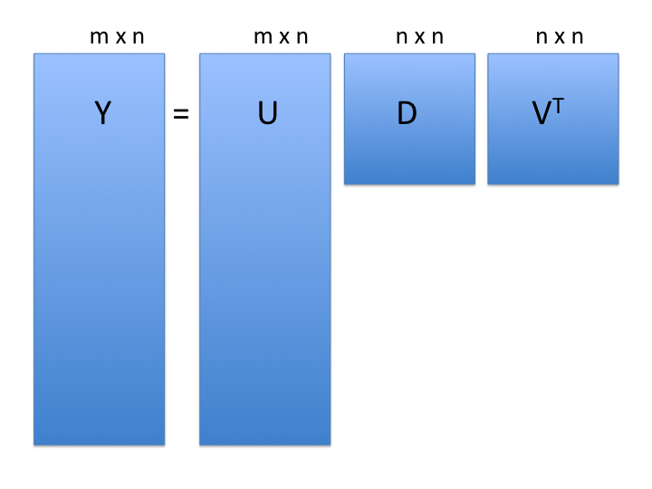
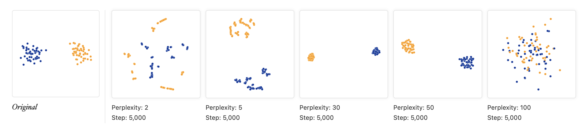

```{r, include = FALSE}
knitr::opts_chunk$set(
  cache = FALSE,
  collapse = TRUE,
  comment = "#>"
)
library(AppStatBio)
```


## Day 2 outline

[Book](https://genomicsclass.github.io/book/) chapter 8:

- Distances in high dimensions
- Principal Components Analysis and Singular Value Decomposition
- Multidimensional Scaling
- t-SNE and UMAP

## Schematic of a typical scRNA-seq analysis workflow


Each stage (separated by dashed lines) consists of a number of specific steps, many of which operate on and modify a SingleCellExperiment instance. ([original image](http://bioconductor.org/books/3.17/OSCA.intro/))

## Metrics and distances

A **metric** is a function that defines a distance between elements of a set and satisfies five key properties:

1.  **Non-negativity:** The distance from point A to point B is always non-negative ($d(a, b) \ge 0$).
2.  **Symmetry:** The distance from A to B is the same as the distance from B to A ($d(a, b) = d(b, a)$).
3.  **Identity of indiscernibles:** The distance from a point to itself is zero ($d(a, a) = 0$).
4.  **Definiteness:** The distance is zero if and only if the points are the same ($d(a, b) = 0 \iff a=b$).
5.  **Triangle Inequality:** The distance from A to C is never greater than the sum of the distances from A to B and B to C ($d(a, c) \le d(a, b) + d(b, c)$).

- A **distance** is a more general term, typically required to satisfy only the first three properties.
- A **similarity function** also satisfies non-negativity and symmetry, but its value **increases** as two objects become more alike.
- A **dissimilarity function** is similar, but its value **decreases** as objects become more alike.

## Euclidian distance (metric)

- Remember grade school:
```{r, echo=FALSE, fig.height=3.5}
rafalib::mypar()
plot(
    c(0, 1, 1),
    c(0, 0, 1),
    pch = 16,
    cex = 2,
    xaxt = "n",
    yaxt = "n",
    xlab = "",
    ylab = "",
    bty = "n",
    xlim = c(-0.25, 1.25),
    ylim = c(-0.25, 1.25)
)
lines(c(0, 1, 1, 0), c(0, 0, 1, 0))
text(0, .2, expression(paste('(A'[x] * ',A'[y] * ')')), cex = 1.5)
text(1, 1.2, expression(paste('(B'[x] * ',B'[y] * ')')), cex = 1.5)
text(-0.1, 0, "A", cex = 2)
text(1.1, 1, "B", cex = 2)
```
<center>
Euclidean d = $\sqrt{ (A_x-B_x)^2 + (A_y-B_y)^2}$.
</center>

- **Side note**: also referred to as *$L_2$ norm*

## Euclidian distance in high dimensions

This familiar concept from geometry extends directly into higher dimensions, which is essential for analyzing complex biological datasets.

```{r, echo = FALSE, message=FALSE}
if(!require(tissuesGeneExpression)){
  BiocManager::install("genomicsclass/tissuesGeneExpression")
}
if(!require(GSE5859)){
  BiocManager::install("genomicsclass/GSE5859")
}
```

```{r getdata}
## BiocManager::install("genomicsclass/tissuesGeneExpression") #if needed
## BiocManager::install("genomicsclass/GSE5859") #if needed
library(GSE5859)
library(tissuesGeneExpression)
data(tissuesGeneExpression)
dim(e) ##gene expression data
table(tissue) ##tissue[i] corresponds to e[,i]
```

Interested in identifying similar *samples* and similar *genes*

## Notes about Euclidian distance in high dimensions

- Points are no longer on the Cartesian plane
- instead they are in higher dimensions. For example:
    - sample $i$ is defined by a point in 22,215 dimensional space: $(Y_{1,i},\dots,Y_{22215,i})^\top$. 
    - feature $g$ is defined by a point in 189 dimensions $(Y_{g,189},\dots,Y_{g,189})^\top$

Euclidean distance as for two dimensions. E.g., the distance between two samples $i$ and $j$ is:

$$ \mbox{dist}(i,j) = \sqrt{ \sum_{g=1}^{22215} (Y_{g,i}-Y_{g,j })^2 } $$

and the distance between two features $h$ and $g$ is:

$$ \mbox{dist}(h,g) = \sqrt{ \sum_{i=1}^{189} (Y_{h,i}-Y_{g,i})^2 } $$

## Euclidian distance in matrix algebra notation

The Euclidian distance between samples $i$ and $j$ can be written as:

$$ \mbox{dist}(i,j) = \sqrt{ (\mathbf{Y}_i - \mathbf{Y}_j)^\top(\mathbf{Y}_i - \mathbf{Y}_j) }$$

with $\mathbf{Y}_i$ and $\mathbf{Y}_j$ columns $i$ and $j$. 

```{r tdata}
t(matrix(1:3, ncol = 1))
matrix(1:3, ncol = 1)
t(matrix(1:3, ncol = 1)) %*% matrix(1:3, ncol = 1)
```

## Note about matrix algebra in R 

* "Stock" R may use an unoptimized `LAPACK` for matrix algebra. Large speed
gains may be made by compiling against:
    + [OpenBLAS](https://www.openblas.net/)
    + [Intel Math Kernel Library](https://software.intel.com/content/www/us/en/develop/tools/oneapi/components/onemkl.html)
    + [Apple Accelerate Framework (macOS)](https://developer.apple.com/documentation/accelerate) (default for MacOS R binaries)
    
* for very large matricies, consider:
    + setting the `nu` and `nv` arguments to the `svd()` function
    + the [Matrix](https://CRAN.R-project.org/package=Matrix) CRAN package (sparse matrices)
    + the [rhdf5](https://bioconductor.org/packages/rhdf5/) and [DelayedArray](https://bioconductor.org/packages/DelayedArray/) Bioconductor packages (on-disk arrays)

## 3 sample example

```{r 3samp}
kidney1 <- e[, 1]
kidney2 <- e[, 2]
colon1 <- e[, 87]
sqrt(sum((kidney1 - kidney2) ^ 2))
sqrt(sum((kidney1 - colon1) ^ 2))
```

## 3 sample example using dist()

```{r dist}
dim(e)
(d <- dist(t(e[, c(1, 2, 87)])))
class(d)
```

## The dist() function

Excerpt from ?dist:

```{r distfun, eval=FALSE}
dist(
    x,
    method = "euclidean",
    diag = FALSE,
    upper = FALSE,
    p = 2
)
```

- **method:** the distance measure to be used. 
    - This must be one of "euclidean", "maximum", "manhattan", "canberra", "binary" or "minkowski". Any unambiguous substring can be given.
- `dist` class output from `dist()` is used for many clustering algorithms and heatmap functions

*Caution*: `dist(e)` creates a `r nrow(e)` x `r nrow(e)` matrix that will probably crash your R session.

## Note on standardization

- In practice, features (e.g. genes) are typically "standardized", *i.e.* scaled and centered, *i.e.* converted to z-score:

$$x_{gi} \leftarrow \frac{(x_{gi} - \bar{x}_g)}{s_g}$$

- This is done because the differences in overall levels between features are often not due to biological effects but technical ones, *e.g.*:
    - GC bias, PCR amplification efficiency, ...
- Also, usually only "highly variable genes" are used to avoid scaling noise

## Dimension reduction and PCA

* Motivation for dimension reduction

Simulate the heights of twin pairs:
```{r simtwins}
set.seed(1)
n <- 100
y <- t(MASS::mvrnorm(n, c(0, 0), matrix(c(1, 0.95, 0.95, 1), 2, 2)))
dim(y)
cor(t(y))
```

## Visualizing twin pairs data

```{r vistwins, echo=FALSE}
z1 = (y[1,] + y[2,]) / 2 #the sum
z2 = (y[1,] - y[2,])   #the difference

z = rbind(z1, z2) #matrix now same dimensions as y

thelim <- c(-3, 3)
rafalib::mypar(1, 2)

plot(
    y[1,],
    y[2,],
    xlab = "Twin 1 (standardized height)",
    ylab = "Twin 2 (standardized height)",
    xlim = thelim,
    ylim = thelim,
    main = "Original twin heights"
)
points(y[1, 1:2], y[2, 1:2], col = 2, pch = 16)

plot(
    z[1,],
    z[2,],
    xlim = thelim,
    ylim = thelim,
    xlab = "Average height",
    ylab = "Difference in height",
    main = "Manual PCA-like projection"
)
points(z[1, 1:2] , z[2, 1:2], col = 2, pch = 16)
```

## Not much distance is lost in the second dimension

```{r twindists, echo=FALSE}
rafalib::mypar()
d = dist(t(y))
d3 = dist(z[1, ]) * sqrt(2) ##distance computed using just first dimension mypar(1,1)
plot(as.numeric(d),
     as.numeric(d3),
     xlab = "Pairwise distances in 2 dimensions",
     ylab = "Pairwise distances in 1 dimension")
abline(0, 1, col = "red")
```

- Not much loss of height differences when just using average heights of twin pairs.
    - because twin heights are highly correlated

## Singular Value Decomposition (SVD)

SVD generalizes the example rotation we looked at:

$$\mathbf{Y} = \mathbf{UDV}^\top$$

<center>

</center>

- **note**: the above formulation is for $m$ rows $> n$ columns

- $\mathbf{Y}$: the $m$ rows x $n$ cols matrix of measurements
- $\mathbf{U}$: $m \times n$ matrix relating original scores to PCA scores (**loadings**)
- $\mathbf{D}$: $n \times n$ diagonal matrix (**eigenvalues**)
- $\mathbf{V}$: $n \times n$ *orthogonal* matrix (**eigenvectors or PCA scores**)
    - orthogonal = unit length and "perpendicular" in 3-D

## SVD of gene expression dataset

Center but do not scale, just to make plots before more legible:
```{r scaling, cache=TRUE}
e.standardize <- t(scale(t(e), scale = FALSE))
```

SVD:
```{r svd}
s <- svd(e.standardize)
names(s)
```

## Components of SVD results

```{r dimsvd}
dim(s$u)     # loadings
length(s$d)  # eigenvalues
dim(s$v)     # d %*% vT = scores
```
<center>

</center>

## PCA is a SVD

* gene expression dataset

```{r pcavssvd, cache=TRUE}
rafalib::mypar()
p <- prcomp(t(e.standardize))
plot(s$u[, 1] ~ p$rotation[, 1])
```

**Lesson:** u and v can each be multiplied by -1 arbitrarily

## PCA interpretation: loadings

<center>

</center>

- $\mathbf{U}$ (**loadings**): relate the *principal component* axes to the original variables
    - think of principal component axes as a weighted combination of original axes

## Visualizing PCA loadings

```{r visloadings}
plot(p$rotation[, 1],
     xlab = "Index of genes",
     ylab = "Loadings of PC1",
     main = "PC1 loadings of each gene") #or, predict(p)
abline(h = c(-0.03, 0.03), col = "red")
```

## Genes with high PC1 loadings

```{r pheatmaploadings, fig.height=3.5}
e.pc1genes <-
    e.standardize[p$rotation[, 1] < -0.03 |
                           p$rotation[, 1] > 0.03,]
pheatmap::pheatmap(
    e.pc1genes,
    scale = "none",
    show_rownames = TRUE,
    show_colnames = FALSE
)
```

## PCA interpretation: eigenvalues

- $\mathbf{D}$ (**eigenvalues**): standard deviation scaling factor that each decomposed variable is multiplied by.

```{r screeplot, fig.height=3, fig.width=5, echo=TRUE, fig.align='center'}
rafalib::mypar()
plot(
    p$sdev ^ 2 / sum(p$sdev ^ 2) * 100,
    xlim = c(0, 150),
    type = "b",
    ylab = "% variance explained",
    main = "Screeplot"
)
```

## PCA interpretation: eigenvalues

Alternatively as cumulative % variance explained (using `cumsum()` function)

```{r cumscreeplot, fig.height=4, echo=TRUE, fig.align='center'}
rafalib::mypar()
plot(
    cumsum(p$sdev ^ 2) / sum(p$sdev ^ 2) * 100,
    ylab = "cumulative % variance explained",
    ylim = c(0, 100),
    type = "b",
    main = "Cumulative screeplot"
)
```

## PCA interpretation: scores

<center>

</center>

- $\mathbf{V}$ (**scores**): The "datapoints" in the reduced prinipal component space
- In some implementations (like `prcomp()`), scores are already scaled by eigenvalues: $\mathbf{D V^T}$

## PCA interpretation: scores

```{r scores, fig.height=5, echo=FALSE}
rafalib::mypar()
plot(
    p$x[, 1:2],
    xlab = "PC1",
    ylab = "PC2",
    main = "plot of p$x[, 1:2]",
    col = factor(tissue),
    pch = as.integer(factor(tissue))
)
legend(
    "topright",
    legend = levels(factor(tissue)),
    col = 1:length(unique(tissue)),
    pch = 1:length(unique(tissue)),
    bty = 'n'
)
```

## Multi-dimensional Scaling (MDS)

- also referred to as Principal Coordinates Analysis (PCoA)
- a reduced SVD, performed on a distance matrix
- identify two (or more) eigenvalues/vectors that preserve distances

```{r mds}
d <- as.dist(1 - cor(e.standardize))
mds <- cmdscale(d)
```

```{r plotmds, echo=FALSE}
rafalib::mypar()
plot(mds, col = factor(tissue), pch = as.integer(factor(tissue)))
legend(
    "topright",
    legend = levels(factor(tissue)),
    col = 1:length(unique(tissue)),
    bty = 'n',
    pch = 1:length(unique(tissue))
)
```

## t-SNE

* non-linear dimension reduction method very popular for visualizing single-cell data
    - almost magical ability to show clearly separated clusters
    - performs different transformations on different regions
* computationally intensive so usually done only on top ~30 PCs
* t-SNE is sensitive to choices of tuning parameters
    - "perplexity" parameter defines (loosely) how to balance attention between local and global aspects of data
    - optimal choice of perplexity changes for different numbers of cells from the **same** sample. 
    - perplexity = $\sqrt{N}$ is one rule of thumb. $max(N/5, 50)$ is another (default of [Rtsne](https://cran.r-project.org/package=Rtsne))
    - Here is a [good post by Nikolay Oskolkov](https://towardsdatascience.com/how-to-tune-hyperparameters-of-tsne-7c0596a18868) on this topic.

## t-SNE caveats

* uses a random number generator
* apparent spread of clusters is completely meaningless
* distance between clusters might also not mean anything
* parameters can be tuned to make data appear how you want
* can show apparent clusters in random noise. Should _not_ be used for statistical inference
* Try it to gain some intuition: https://distill.pub/2016/misread-tsne/)



## PCA of Zeisel single-cell RNA-seq dataset

```{r loadlibraries, include=FALSE}
suppressPackageStartupMessages({
  library(scRNAseq)
  library(BiocSingular)
  library(scran)
  library(scater)
})
sce.zeisel <- ZeiselBrainData()
sce.zeisel <- logNormCounts(sce.zeisel)
```

```{r plotpcazeisel, fig.cap="Principal Components Analysis of Zeisel dataset"}
sce.zeisel <- fixedPCA(sce.zeisel, subset.row=NULL)
plotReducedDim(sce.zeisel, dimred="PCA", colour_by="level1class")
```

## t-SNE of the same dataset

```{r tsenzeisel, fig.cap="t-SNE clustering of Zeisel dataset"}
sce.zeisel <- runTSNE(sce.zeisel, dimred="PCA")
plotReducedDim(sce.zeisel, dimred="TSNE", colour_by="level1class")
```

## UMAP vs t-SNE

* UMAP may better preserve local and global distances
* tends to have more compact visual clusters with more empty space between them
* more computationally efficient
* also involves random number generation
* Note: I prefer _not_ setting the random number seed during exploratory analysis in order to see the random variability

## UMAP of the same dataset

```{r umapzeisel, fig.cap = "UMAP representation of the Zeisel dataset"}
sce.zeisel <- runUMAP(sce.zeisel, dimred="PCA")
plotReducedDim(sce.zeisel, dimred="UMAP", colour_by="level1class")
```

## tSNE of tissue microarray data

Using default parameters and no log transformation

```{r umaptsnezeisel}
sct <- SingleCellExperiment(e)
sct$tissue <- tissue
# fake the log normalization because it is undesirable for microarray data
names(assays(sct)) <- "logcounts" 
sct <- fixedPCA(sct, subset.row=NULL)
sct <- runTSNE(sct, dimred="PCA")
plotReducedDim(sct, dimred="TSNE", colour_by="tissue")
```

## UMAP of tissue microarray data

Also using default parameters and no log transformation

```{r nologumap}
sct <- runUMAP(sct, dimred="PCA")
plotReducedDim(sct, dimred="UMAP", colour_by="tissue")
```

## Summary: distances and dimension reduction

- **Note**: signs of rotations (loadings) and eigenvectors (scores) can be arbitrarily flipped
- PCA and MDS are useful for dimension reduction when you have **correlated variables**
- Variables are always centered.  
- Variables are also scaled unless you know they have the same scale in the population
- PCA projection can be applied to new datasets if you know the matrix calculations
- PCA is subject to over-fitting, screeplot can be tested by cross-validation
- PCA is often used prior to t-SNE and UMAP for de-noising and computational tractability

## Lab exercise

* OSCA Basics: [Chapter 4 Dimensionality Reduction](http://bioconductor.org/books/release/OSCA.basic/dimensionality-reduction.html)
* Optional if you are interested, OSCA Advanced: [Chapter 4 Dimensionality reduction, redux](http://bioconductor.org/books/release/OSCA.advanced/dimensionality-reduction-redux.html)

## Links

- A built [html][] version of this lecture is available.
- The [source][] R Markdown is also available from Github.

[html]: https://waldronlab.io/AppStatBio/articles/day2_unsupervised.html
[source]: https://github.com/waldronlab/AppStatBio/blob/main/vignettes/day2_unsupervised.Rmd
